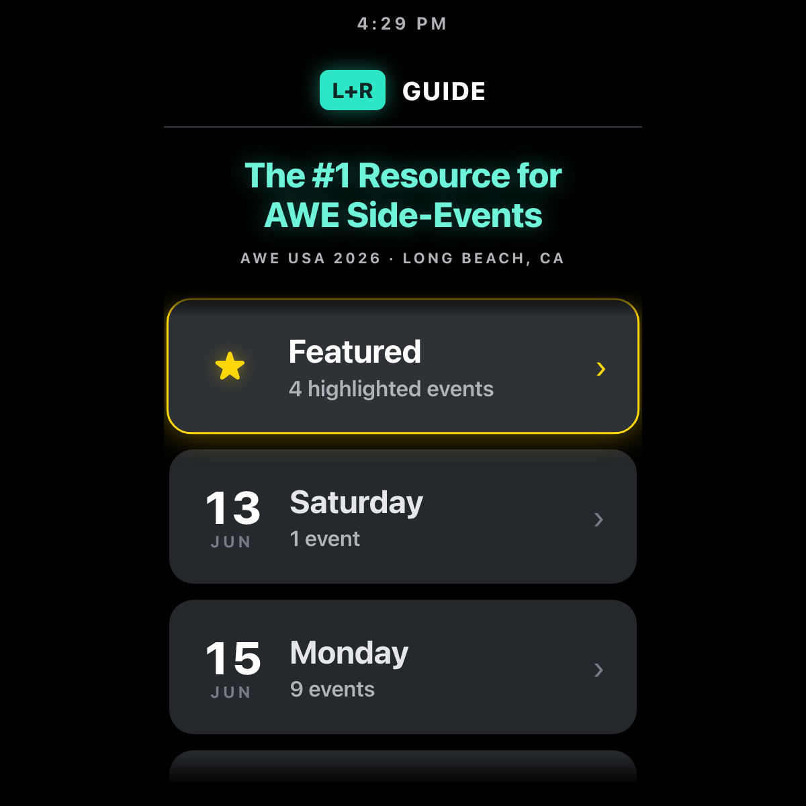

# AWE Side-Events Guide

A heads-up version of the **L+R Guide to AWE USA 2026 side-events** ([awexr.events](https://awexr.events)), rebuilt for the Meta Ray-Ban Display. Same teal L+R look, reauthored for a glance-and-go HUD you drive with the D-pad — browse the week, see what's next, and check an event's details without pulling out your phone.

---

## What it does

- **Day-first browsing.** Root screen lists each conference day (Jun 13–18) with an event count, plus a **Featured** shortcut that surfaces the highlighted events one step from home.
- **Glanceable event cards.** Large start time on the left, a two-line title, and a colour + label price tag (`FREE · RSVP`, `PUBLIC`, `TICKETED`, `DETAILS`) — never colour alone, so it reads under glare.
- **Detail view.** Hero start time, full title, date, time window, location, and price for a single event.
- **Additive-safe styling.** Dark `#1C1E21` background (never `#000`, which is transparent on the waveguide), teal accent for brand continuity, gold for featured.
- **Shallow nav.** Never more than three steps deep — Days → Events → Detail — matching the watchOS-HUD overview→detail pattern.
- **No network.** All 24 events are bundled; the app runs fully offline in the glasses' built-in browser.

---

## Controls

| Where | Input | Result |
| --- | --- | --- |
| Days | ▲ ▼ | Move focus through days / Featured |
| Days | Enter / ▶ | Open the focused day's events |
| Events | ▲ ▼ | Move focus through events |
| Events | Enter / ▶ | Open event details |
| Events | ◀ | Back to days |
| Detail | ◀ / Enter | Back to the events list |

---

## Screenshots

| Day picker |
| --- |
|  |

---

## Running locally

The app is a single static HTML/CSS/JS bundle — no build step.

```bash
npx serve -l 4233 awe-events
# then open http://localhost:4233
```

### Regenerating the screenshot

> 🛠️ **Developer tooling only.** The app itself has zero Chrome dependency — it's vanilla HTML/CSS/JS that runs in the Ray-Ban Meta Display's built-in browser. The block below is just the local recipe used on a Mac to refresh the PNG in `screenshots/`.

```bash
npx serve -l 4333 awe-events &
CHROME="/Applications/Google Chrome.app/Contents/MacOS/Google Chrome"
"$CHROME" --headless --disable-gpu --hide-scrollbars \
  --force-device-scale-factor=2 --window-size=500,600 \
  --screenshot="awe-events/screenshots/preview.png" \
  "http://localhost:4333/"
```

---

## Files

```
awe-events/
├── index.html      # day picker, event list, and detail screens
├── styles.css      # 500×600 dark theme, teal L+R accent, gold featured
├── app.js          # bundled event data + D-pad state machine
├── favicon.svg     # teal L+R mark
└── screenshots/    # capture used by this README
```

Source data mirrors [awexr.events](https://awexr.events). L+R is not an official AWE USA 2026 affiliate; this is an independent guide.

---

<sub>Made by Alex Levin at [L+R](https://www.levinriegner.com).</sub>
