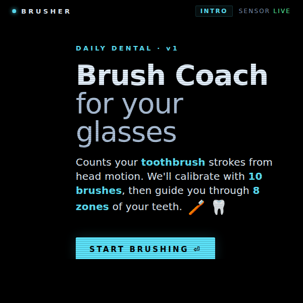
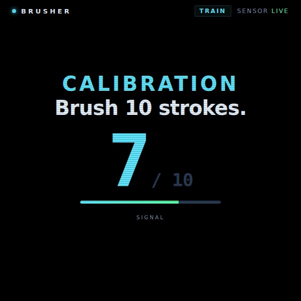
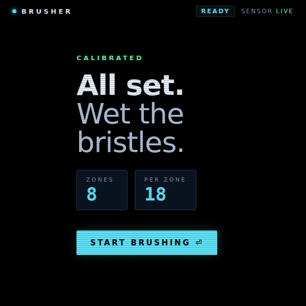
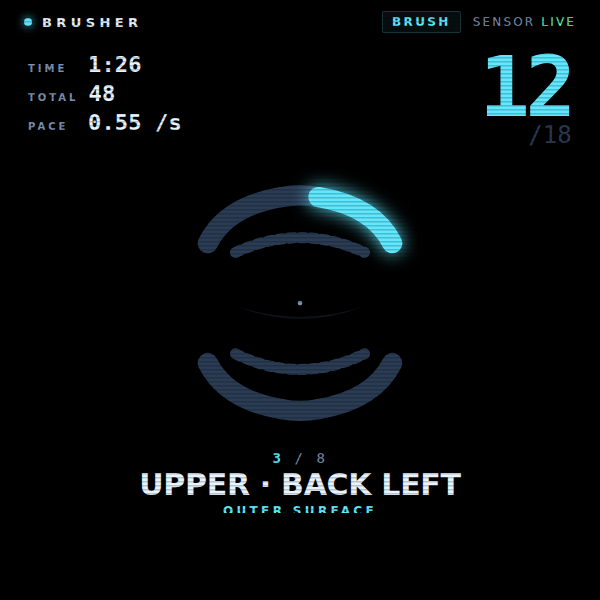
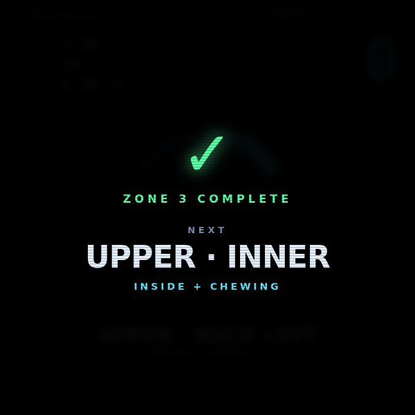
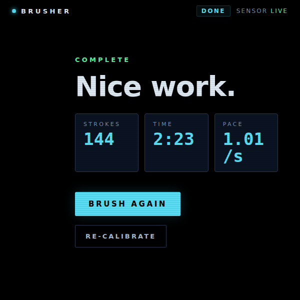

# Brusher

A heads-up **brush coach** for Meta Display glasses. It counts your toothbrush strokes from head motion, calibrates itself in ten brushes, then walks you through the eight zones of your teeth on a big anatomical mouth diagram — so you actually finish the two-minute routine the dentist keeps asking about.

> 📖 **Case study:** [levinriegner.com/work/brush-coach](https://www.levinriegner.com/work/brush-coach/)
> 🌐 **Live demo:** [rbm-demos.lnr.io/brusher](https://rbm-demos.lnr.io/brusher/)

---

## What it does

- **Head-motion stroke detection.** Reads `devicemotion` from the glasses, high-passes each axis (to drop gravity and slow pose), then counts rising-edge peaks on the dominant axis. A 180 ms refractory window prevents double-counts.
- **10-stroke self-calibration.** First time through, the app watches all three axes in parallel and picks whichever one fired the most peaks as the dominant axis. Detection threshold is set to half the median peak amplitude, clamped to a safe range — so it auto-adapts to gentle vs aggressive brushers.
- **8 zones, 18 strokes each.** Clockwise tour of the mouth — Upper Back Right / Front / Back Left / Inner, then the same for Lower. Big SVG mouth diagram highlights the current arch.
- **Glanceable HUD.** Persistent TIME / TOTAL / PACE column on the left, big zone count on the right, current zone label centered at the bottom. Zone-complete handoff is a full-bleed `✓` popover that previews the next zone for ~1.7 s before auto-advancing.
- **Audio-only feedback.** Each stroke chirps at 880 Hz, zone completion plays a two-note rise, calibration plays a three-note arpeggio, finish plays a triumphant cadence — all synthesised live via Web Audio, no asset files.
- **Keyboard fallback.** Every motion event has a key equivalent so the demo is usable on a laptop without a real IMU — `↓` fires a manual stroke during training and brushing.
- **iOS permission flow.** On Safari (iOS), the first BEGIN press pops a `DeviceMotionEvent.requestPermission()` overlay; on other platforms the sensor is hooked up at load so the SENSOR pill goes LIVE before you even start.

---

## Controls

| Where | Input | Result |
| --- | --- | --- |
| Intro | Enter | Begin (request motion access on iOS, then start calibration) |
| Calibration | Head motion | Counts strokes on the dominant axis until 10, then auto-advances |
| Calibration | ▼ | Fake-stroke (keyboard fallback when there's no IMU) |
| Calibration | ▲ | Reset the calibration counter |
| Ready | Enter | Start the 8-zone brushing session |
| Ready | ▲ | Re-calibrate |
| Brushing | Head motion | Counts strokes toward the per-zone target of 18 |
| Brushing | ▼ | Fake-stroke (keyboard fallback) |
| Brushing | ◀ | Previous zone |
| Brushing | ▶ | Skip to next zone |
| Brushing | ▲ | Re-calibrate |
| Done | ◀ ▶ | Choose BRUSH AGAIN ↔ RE-CALIBRATE |
| Done | Enter | Confirm the focused option |

The phase pill (top-right) shows where you are; the SENSOR pill shows whether the IMU is live, waiting, or fallen back to keys.

---

## Screenshots

### Onboarding

| Intro | Calibration (7 / 10) | Ready |
| --- | --- | --- |
|  |  |  |

### Brushing

| Mid-zone (zone 3 / 8, 12 / 18) | Zone-complete handoff |
| --- | --- |
|  |  |

### Finish

| Session summary |
| --- |
|  |

---

## Running locally

The app is a single static HTML/CSS/JS bundle — no build step.

```bash
npx serve -l 4202 brusher
# then open http://localhost:4202
```

For real head-motion testing, open the served URL on the glasses (or any phone with motion access) — the laptop browser will only fire `devicemotion` if it has an accelerometer.

### Regenerating screenshots

> 🛠️ **Developer tooling only.** The app itself has zero Chrome dependency — it's vanilla HTML/CSS/JS that runs in the Ray-Ban Meta Display's built-in browser. The block below is just the local recipe used to refresh the PNGs in `screenshots/`.

The screenshots above are produced from headless Chrome against the `?state=…` URL parameter the app reads on load (`intro`, `train`, `ready`, `brush`, `zone-complete`, `done`):

```bash
npx serve -l 4202 brusher &
CHROME="/Applications/Google Chrome.app/Contents/MacOS/Google Chrome"
for STATE in intro train ready brush zone-complete done; do
  "$CHROME" --headless=new --disable-gpu --hide-scrollbars \
    --window-size=600,600 --virtual-time-budget=3000 \
    --screenshot="brusher/screenshots/$STATE.png" \
    "http://localhost:4202/?state=$STATE"
done
```

---

## Files

```
brusher/
├── index.html      # 5 screens (intro / train / ready / brush / done) + zone-complete + perm overlays
├── styles.css      # 600×600 lens; black bg, cyan accent, anatomical mouth SVG
├── app.js          # motion high-pass + peak detector, axis auto-pick, zone state machine, Web Audio beeps, ?state= router
└── screenshots/    # generated state captures used by this README
```

---

<sub>Made by Alex Levin at [L+R](https://www.levinriegner.com).</sub>
