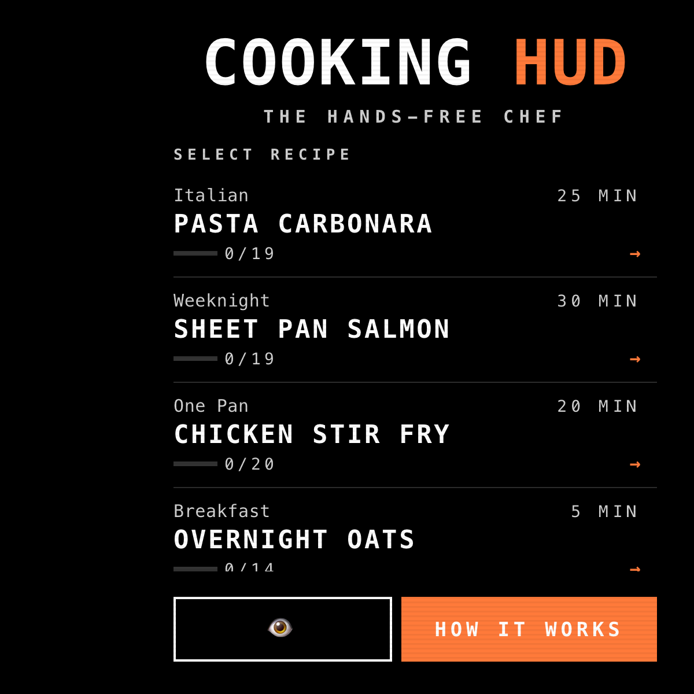
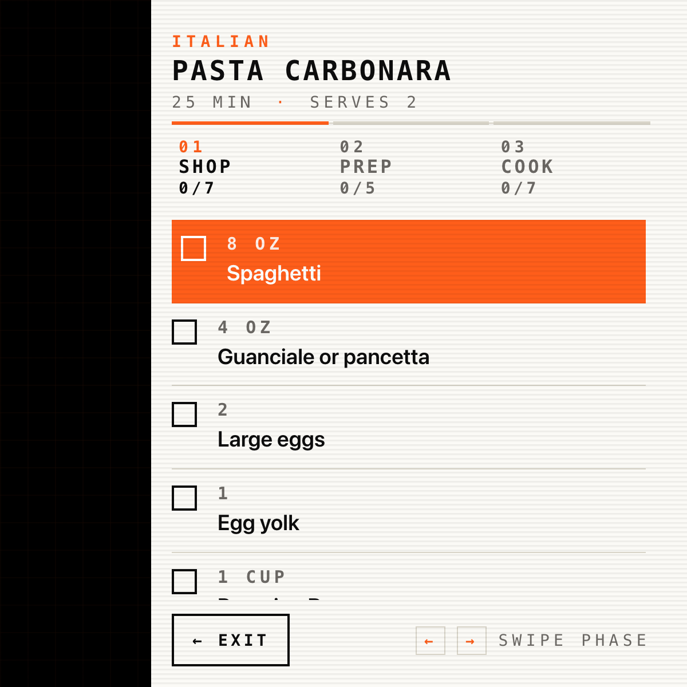
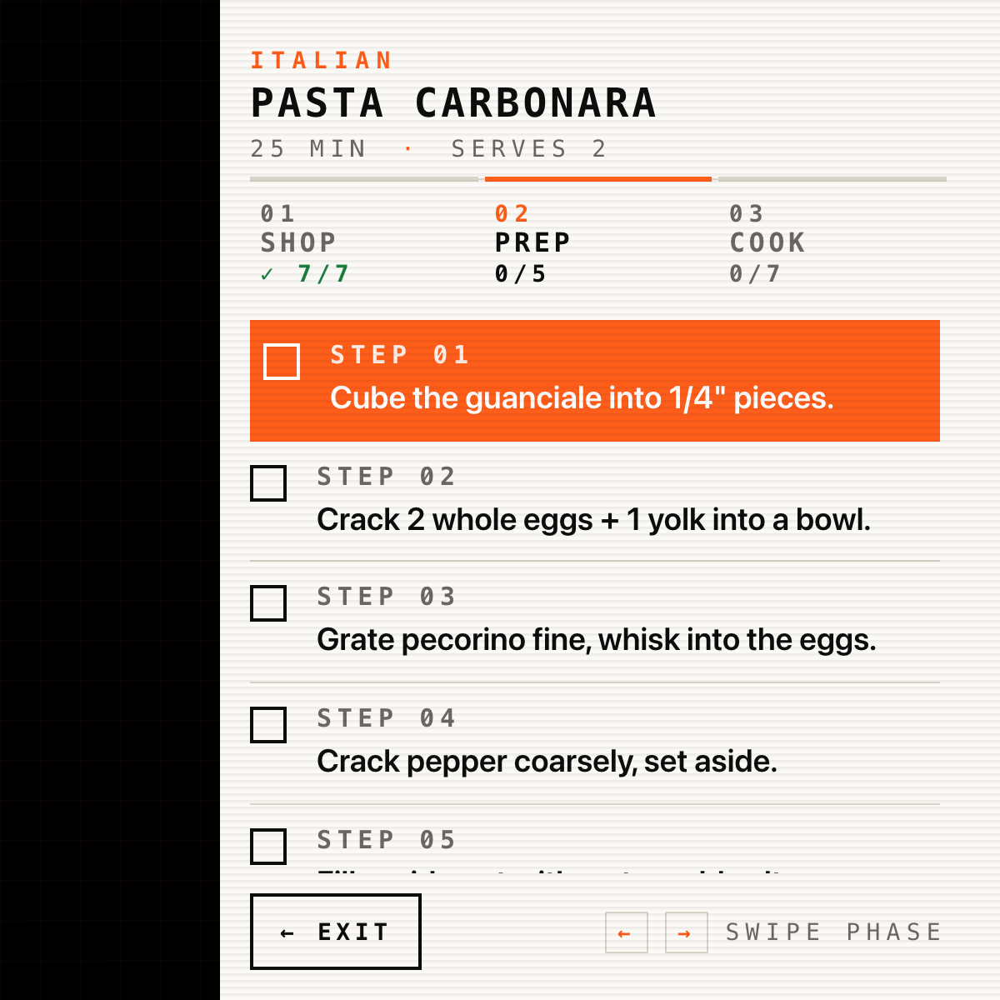
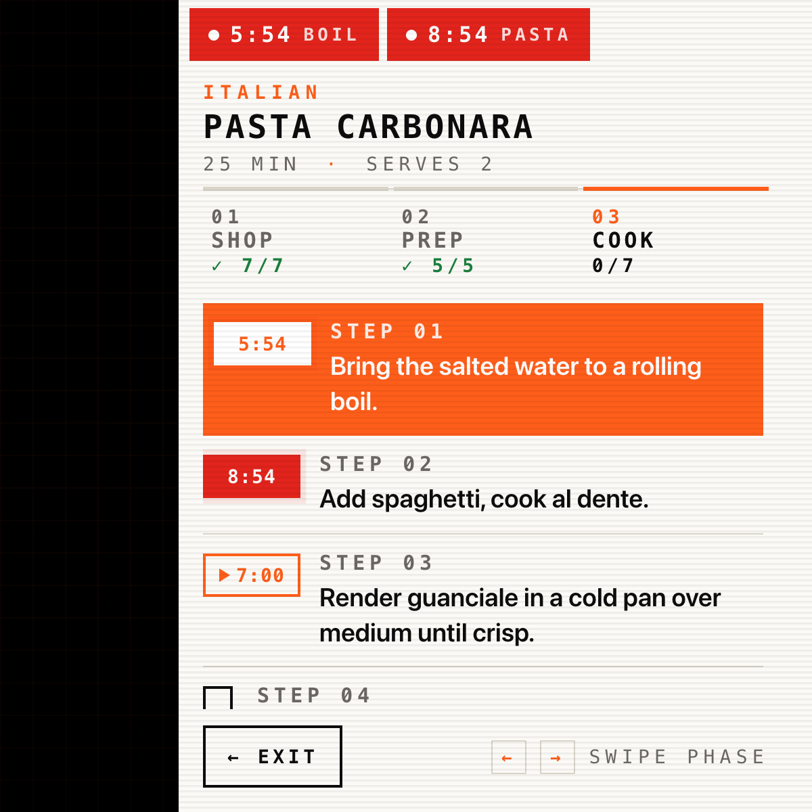

# Cooking HUD

A hands-free cooking companion for the Meta Display glasses that walks you through **shop → prep → cook** as three short, focused lists. Concurrent timers pin to the top of the lens with a one-word descriptor of what they're timing, and phases auto-advance the moment the last item ticks off — so the HUD stays glanceable while your hands stay in the food.

> 📖 **Case study:** [levinriegner.com/work/cooking-hud](https://www.levinriegner.com/work/cooking-hud/)

---

## What it does

- **10 recipes, ranked smart.** Pasta Carbonara, Sheet Pan Salmon, Chicken Stir Fry, Overnight Oats, Tomato Soup, Greek Salad, Beef Tacos, Banana Pancakes, Chocolate Chip Cookies, Sesame Radish Slaw. In-progress recipes float to the top of the home list with an `IN PROGRESS` chip; finished ones drop to the bottom with `DONE`.
- **Three-phase flow.** Each recipe is a `SHOP` (grocery list), `PREP` (mise-en-place), and `COOK` (timed steps) lane. Phase tabs at the top of the recipe screen show `done/total` for each lane, and the screen auto-advances ~900ms after the last item completes — no `NEXT PHASE` button to hunt for.
- **Multi-timer rail with action tags.** Concurrent cook timers pin to the top of the lens as red chips with a one-word descriptor of what's happening — `BOIL`, `PASTA`, `ROAST`, `BAKE`, `REST`, `BROWN`, `SIMMER`, `BEAT`, `COOL`. The rail follows the user across phases and screens.
- **Timer cell IS the checkbox.** On a cook step with a timer, the checkbox is replaced by a state cell that morphs through `▶ 6:00` (idle, outlined) → red `5:54` (running, pulsing) → solid green `✓` (done). Tap = start; tap again = `RESET TIMER?` confirm with the step text on top and `CANCEL` pre-focused.
- **Auto-check on timer end.** When a timer expires the panel pops a red `TIME'S UP — STEP DONE` overlay with a 4-beep AudioContext alarm; dismissing auto-ticks the step and refreshes phase progress.
- **See-through mode.** A small 👁️ toggle on home flips the panel from cream to pure black (which renders fully transparent on the Ray-Ban Display), with bright white + lifted-orange `#ff7a3a` text so the HUD floats cleanly over the real world.
- **AudioContext sound design.** Focus-move click, item check / uncheck, timer start (two-note rise), timer end (4-beep square alarm), phase-complete triad, recipe-complete arpeggio, reset warning. Lazily unlocks on first interaction so autoplay restrictions don't bite.
- **Resume + progress persistence.** `cooking.progress.v1`, `cooking.timers.v1`, `cooking.last.v1`, and `cooking.seethrough.v1` in localStorage so an in-progress recipe (and its running timers) survive reloads. Home surfaces a `RESUME →` button for the most recently touched recipe.

---

## Controls

| Where | Input | Result |
| --- | --- | --- |
| Home | ▲ ▼ | Move focus through recipe list / 👁️ / HOW IT WORKS / RESUME |
| Home | Enter | Open the focused recipe (or toggle see-through / open help) |
| Recipe | ▲ ▼ | Scroll items within the current phase |
| Recipe | ◀ ▶ | Swipe between phases (Shop / Prep / Cook) |
| Shop / Prep | Enter | Check / uncheck the focused item; jumps to the next un-checked |
| Cook (idle) | Enter on timer cell | Start the timer for that step |
| Cook (running) | Enter on timer cell | Open `RESET TIMER?` confirm |
| Cook (done) | Enter on timer cell | Open `RESET STEP?` confirm |
| Confirm | ◀ ▶ | Move between CANCEL / CONFIRM (CANCEL default) |
| Timer alert | Enter on `GOT IT` | Dismiss + auto-check the step |

Touch swipes mirror the arrow keys; Enter mirrors Tap on the actual hardware.

---

## Screenshots

### Home

| Default — recipe list | See-through mode (black panel = transparent on lens) |
| --- | --- |
|  |  |

### Recipe flow

| Shop list | Prep steps | Cook with two timers running |
| --- | --- | --- |
|  |  |  |

---

## Running locally

The app is a single static HTML/CSS/JS bundle — no build step.

```bash
npx serve -l 4205 cooking-hud
# then open http://localhost:4205
```

For development inside the meta-display-glasses-webapps workspace it's also wired into `.claude/launch.json` as the `cooking-hud` preview target on port **4205**.

### Regenerating screenshots

> 🛠️ **Developer tooling only.** The app itself has zero Chrome dependency — it's vanilla HTML/CSS/JS that runs in the Ray-Ban Meta Display's built-in browser. The block below is just the local recipe used on a Mac to refresh the PNGs in `screenshots/`.

The screenshots above are produced from headless Chrome against the `?state=…` URL parameter the app reads on load (`applyUrlState()` in `app.js`):

```bash
npx serve -l 4305 cooking-hud &
CHROME="/Applications/Google Chrome.app/Contents/MacOS/Google Chrome"
for STATE in home home-seethrough shop prep cook; do
  "$CHROME" --headless --disable-gpu --hide-scrollbars \
    --window-size=600,600 --virtual-time-budget=3000 \
    --screenshot="cooking-hud/screenshots/$STATE.png" \
    "http://localhost:4305/?state=$STATE"
done
```

---

## Files

```
cooking-hud/
├── index.html      # home, recipe (3 phases), help, timer alert, confirm
├── styles.css      # 600×600 right-aligned cream HUD; ink + orange palette; see-through overrides
├── app.js          # phase nav, multi-timer engine, AudioContext, ?state= routing
├── data.js         # 10 recipes (shop / prep / cook with timerSec + tag)
└── screenshots/    # generated state captures used by this README
```

---

<sub>Made by Alex Levin at [L+R](https://www.levinriegner.com).</sub>
