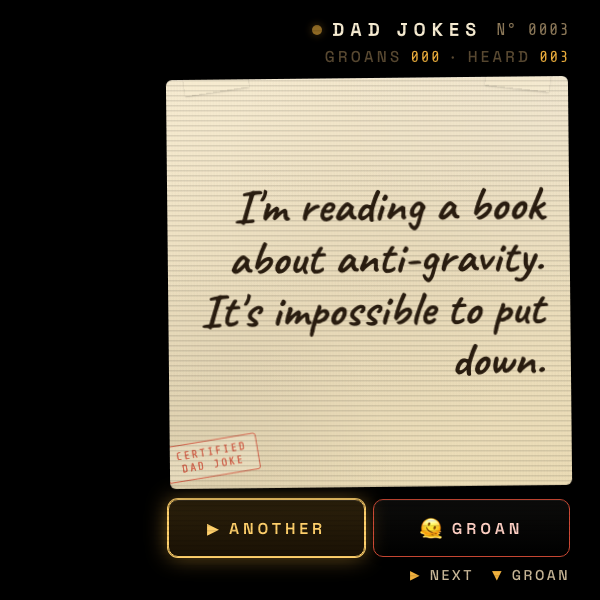
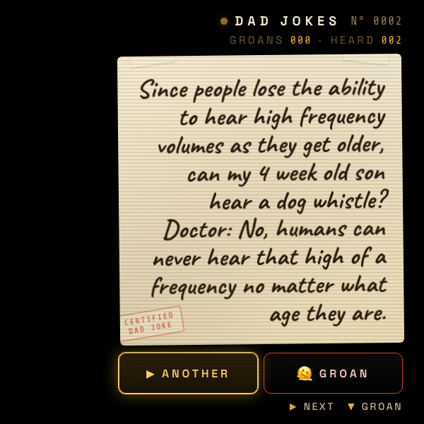

# Dad Jokes

A heads-up display for Meta Display glasses that fetches a random dad joke from [icanhazdadjoke.com](https://icanhazdadjoke.com/) and serves it on a cream paper card. One joke at a time, big enough to read at a glance — press ▶ for the next, ▼ when you need to groan.

---

## What it does

- **Live joke feed.** Pulls a fresh joke from the icanhazdadjoke.com JSON API on load and every time you press ▶ ANOTHER. Multi-paragraph jokes are normalized to one block.
- **Auto-fitting type.** The joke renders in Caveat handwriting at up to 48px and shrinks 1px at a time until the whole thing fits the card — short zingers get the big treatment, long setups quietly step down to 30–40px.
- **Rim shot on every reveal.** A synthesized `ba-dum-tss` (two sine kicks + a highpass-filtered noise crash) fires on every new joke. Audio unlocks on first interaction.
- **Sad trombone on GROAN.** Three descending sawtooth voices through a lowpass + a 360ms screen shake when the joke earns it.
- **Persistent counters.** `HEARD` and `GROANS` survive reloads via `localStorage` (`mdg_dad_jokes_v1`).
- **URL override for screenshots.** `?joke=<text>&heard=N&groans=N` skips the network fetch and renders a specific joke — used by the screenshot regen script below.

> ℹ️ The [icanhazdadjoke.com API](https://icanhazdadjoke.com/api) is free, anonymous, and rate-friendly — no key needed. Pass `Accept: application/json` and you get `{ id, joke, status }`.

---

## Controls

| Where | Input | Result |
| --- | --- | --- |
| Card | ▶ / ◀ / ▲ / Enter / Space | Next joke |
| Card | ▼ / `G` | Groan (sad trombone + shake) |
| Card | Tap anywhere on the joke card | Next joke |
| Card | Tap `▶ ANOTHER` button | Next joke |
| Card | Tap `🫠 GROAN` button | Groan |

Designed for the right-lens HUD: the whole panel is right-aligned (left padding 168px) so content lives in the right half of the 600×600 viewport.

---

## Screenshots

### Default

| A fresh joke on load |
| --- |
|  |

### Auto-fit type

| Short joke (max 48px) | Long joke (auto-shrunk) |
| --- | --- |
|  |  |

---

## Running locally

The app is a single static HTML/CSS/JS bundle — no build step.

```bash
npx serve -l 4213 dad-jokes
# then open http://localhost:4213
```

For development inside the meta-display-glasses-webapps workspace it's also wired into `.claude/launch.json` as the `dad-jokes` preview target on port **4213**.

### Regenerating screenshots

> 🛠️ **Developer tooling only.** The app itself has zero Chrome dependency — it's vanilla HTML/CSS/JS that runs in the Ray-Ban Meta Display's built-in browser. The block below is just the local recipe used on a Mac to refresh the PNGs in `screenshots/`.

The screenshots above are produced from headless Chrome against the `?joke=…` URL parameter the app reads on load:

```bash
npx serve -l 4213 dad-jokes &
CHROME="/Applications/Google Chrome.app/Contents/MacOS/Google Chrome"
enc() { python3 -c 'import urllib.parse,sys; print(urllib.parse.quote(sys.argv[1]))' "$1"; }

HERO="What's black and white and read all over? The newspaper."
SHORT="I'm reading a book about anti-gravity. It's impossible to put down."
LONG=$'Since people lose the ability to hear high frequency volumes as they get older, can my 4 week old son hear a dog whistle?\nDoctor: No, humans can never hear that high of a frequency no matter what age they are.'

for pair in "01-hero:$HERO" "03-short-joke:$SHORT" "02-long-joke:$LONG"; do
  name="${pair%%:*}"
  text="${pair#*:}"
  "$CHROME" --headless=new --disable-gpu --hide-scrollbars \
    --window-size=600,600 --virtual-time-budget=3500 \
    --user-data-dir="/tmp/dj-shoot-$name" \
    --screenshot="dad-jokes/screenshots/$name.png" \
    "http://localhost:4213/?joke=$(enc "$text")&heard=1"
done
```

---

## Files

```
dad-jokes/
├── index.html      # right-aligned HUD layout, joke card + two buttons
├── styles.css      # 600×600 black background, cream paper card, mustard + tomato accents
├── app.js          # fetch loop, audio engine (rim shot + groan), auto-fit, URL override
├── README.md       # this file
└── screenshots/    # captures used by this README
```

---

<sub>Made by Alex Levin at [L+R](https://www.levinriegner.com).</sub>
