# GLIMMER

A Tamagotchi-inspired virtual companion for Meta Display glasses that lives at the edge of your sight. Feed it, play with it, let it rest — care for it and it grows through five distinct life stages. Neglect it and it dies.

> 📖 **Case study:** [levinriegner.com/work/glimmer](https://www.levinriegner.com/work/glimmer/)

---

## What it does

- **Living companion.** A pixel-art creature with four passively-decaying stats — FUEL (hunger), MOOD (happiness), CHARGE (energy), CLEAN (hygiene) — plus a hidden HEALTH stat that degrades if FUEL or CLEAN bottom out. Stats drain on a 4-second tick.
- **Six actions.** FEED, PLAY, REST, WASH, HEAL, and MENU. Each action refills the corresponding stat. MENU opens a pause overlay with RESUME, RENAME COMPANION, and NEW COMPANION.
- **Five evolution stages.** EGG → SPRITE → DRONE → ORACLE → ARCHON. The companion evolves automatically as it ages — provided it stays alive. Higher stages decay faster.
- **Random events.** Poop appears unpredictably (hygiene penalty until washed), mood shifts, and illness occur — keeping you on your toes.
- **Naming & egg selection.** On first launch (or after adopting a new companion) you choose a name — type it directly, or roll a random generated one — then pick an egg colour: Amethyst, Jade, or Ember.
- **Generation tracking.** A GEN counter in the footer increments each time a companion dies and a new one is adopted, preserving your lineage across generations.
- **Offline catch-up.** Stats update on re-open based on elapsed real time, capped at 2 hours to prevent instant death from being away too long.
- **Persistent state.** Everything is saved to `localStorage` and restored on the next visit.

---

## Controls

| Where | Input | Result |
| --- | --- | --- |
| Anywhere | Tab / D-pad | Move focus between buttons |
| Anywhere | Enter / Space | Activate focused button |
| Main screen | FEED | Fill FUEL stat |
| Main screen | PLAY | Fill MOOD stat |
| Main screen | REST | Fill CHARGE stat (companion sleeps) |
| Main screen | WASH | Fill CLEAN stat |
| Main screen | HEAL | Restore HEALTH |
| Main screen | MENU | Open pause menu |
| Menu | RESUME | Close menu, return to companion |
| Menu | RENAME COMPANION | Edit companion name |
| Menu | NEW COMPANION | Abandon current, start adoption flow |
| Naming screen | Type | Edit name directly (max 14 chars, auto-uppercase) |
| Naming screen | RANDOM | Roll a random generated name |
| Dead screen | ADOPT NEW COMPANION | Begin new companion flow |

---

## Screenshots

### Onboarding

| Welcome | Name your companion | Pick your egg |
| --- | --- | --- |
| 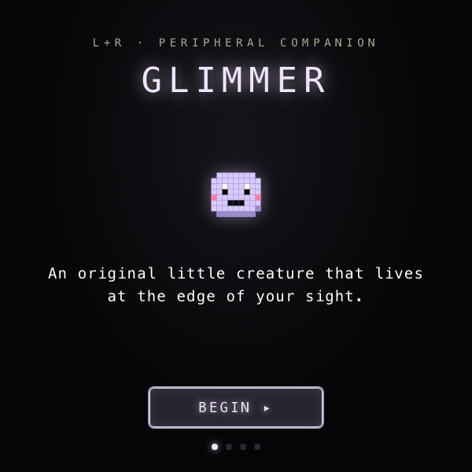 | 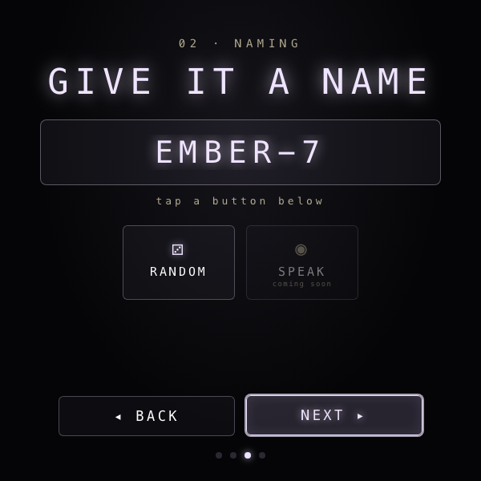 |  |

### Main game

| Healthy companion (SPRITE stage) | Pause menu |
| --- | --- |
| 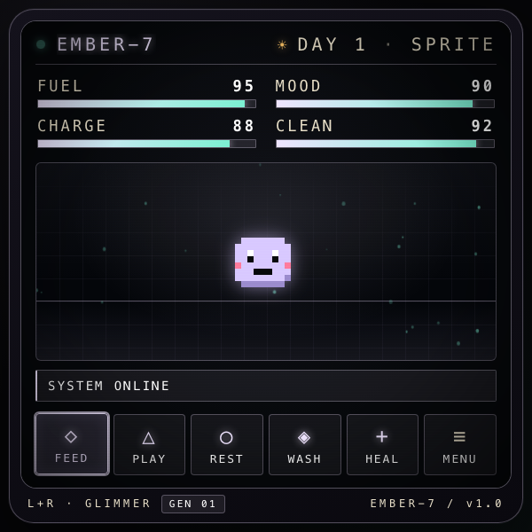 | 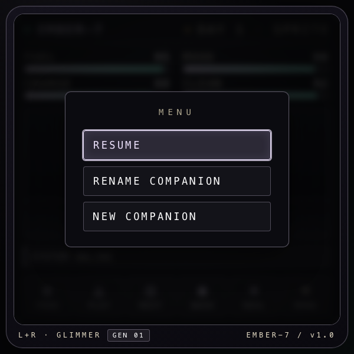 |

### Death & adoption

| Companion death | New companion flow |
| --- | --- |
| 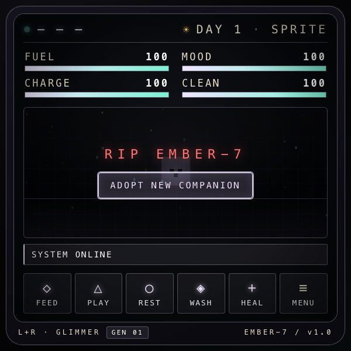 | 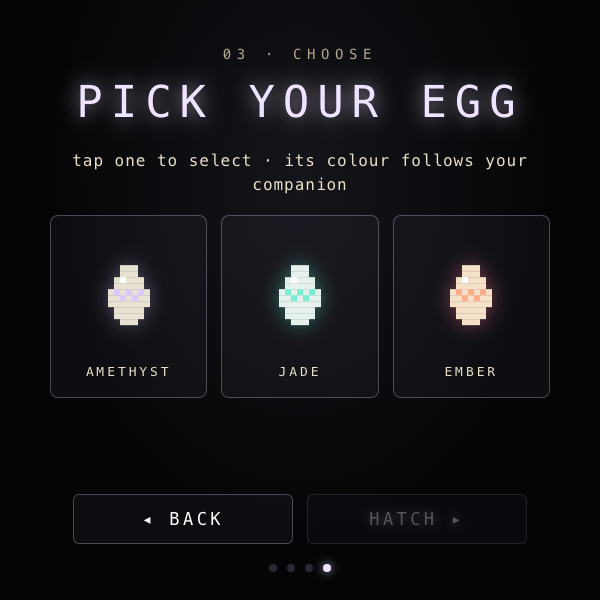 |

---

## Egg Variants

Choose your egg at the start — each colour is purely cosmetic and sets the companion's palette for its whole life.

| Amethyst | Jade | Ember |
| --- | --- | --- |
| 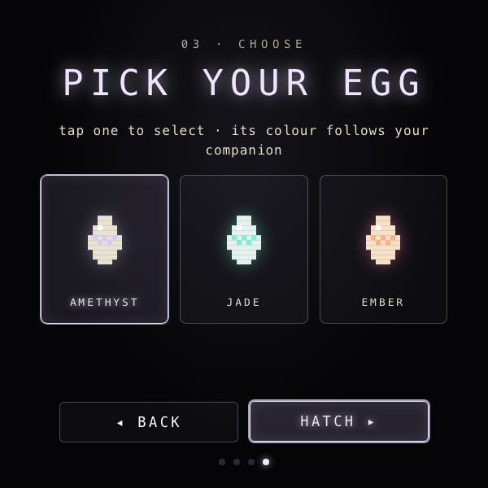 | 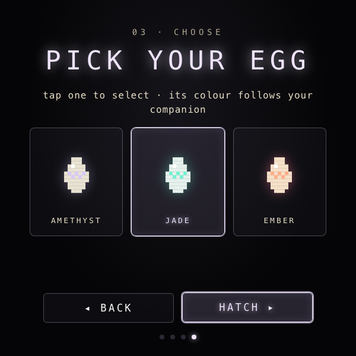 | 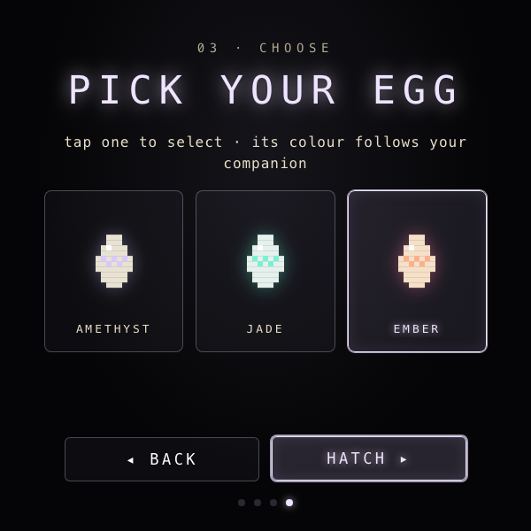 |

---

## Evolution Stages

The companion grows through five stages as it ages. Each stage unlocks a new visual form and increases stat decay rate — the older it gets, the more care it needs.

| EGG | SPRITE | DRONE | ORACLE | ARCHON |
| --- | --- | --- | --- | --- |
| 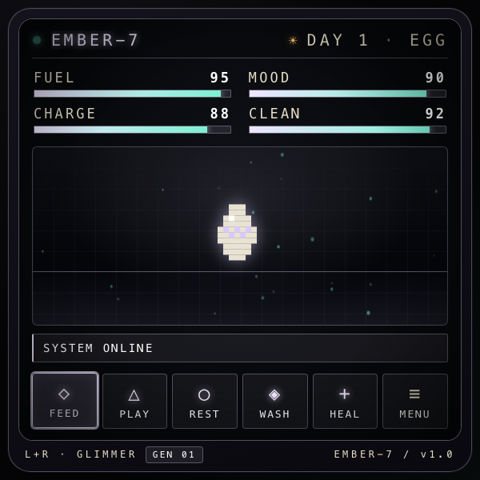 | 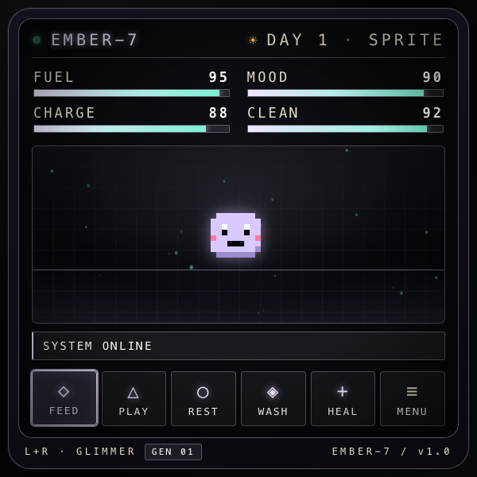 | 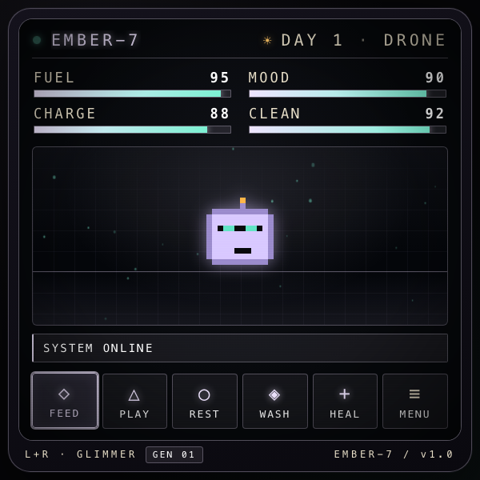 | 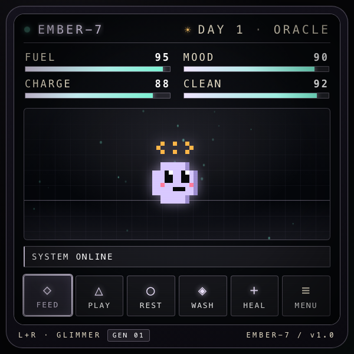 | 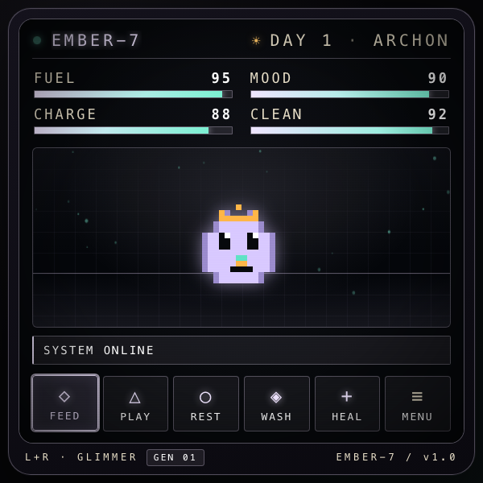 |

---

## Running locally

The app is a single static HTML/CSS/JS bundle — no build step.

```bash
npx serve -l 4201 lr-glimmer
# then open http://localhost:4201
```

For development inside the meta-display-glasses-webapps workspace it's also wired into `.claude/launch.json` as the `lr-glimmer` preview target on port **4201**.

### Regenerating screenshots

> 🛠️ **Developer tooling only.** The app itself has zero Chrome dependency — it's vanilla HTML/CSS/JS that runs in the Ray-Ban Meta Display's built-in browser. The block below is just the local recipe used on a Mac to refresh the PNGs in `screenshots/`.

The screenshots above are produced from headless Chrome against the `?state=…` URL parameter the app reads on load:

```bash
npx serve -l 4301 lr-glimmer &
CHROME="/Applications/Google Chrome.app/Contents/MacOS/Google Chrome"
mkdir -p lr-glimmer/screenshots

for STATE in welcome naming egg-select game menu dead adopt \
             egg-amethyst egg-jade egg-ember \
             stage-egg stage-sprite stage-drone stage-oracle stage-archon; do
  "$CHROME" --headless=new --disable-gpu --hide-scrollbars \
    --window-size=600,600 --virtual-time-budget=3000 \
    --screenshot="lr-glimmer/screenshots/$STATE.png" \
    "http://localhost:4301/?state=$STATE"
done
```

---

## Files

```
lr-glimmer/
├── index.html      # walkthrough, game HUD, menus, dead overlay
├── styles.css      # 600×600 CRT aesthetic; lavender + amber + teal
├── app.js          # state machine, tick loop, Canvas 2D creature drawing
└── screenshots/    # screen captures used by this README
```

---

<sub>Made by Alex Levin at [L+R](https://www.levinriegner.com).</sub>
