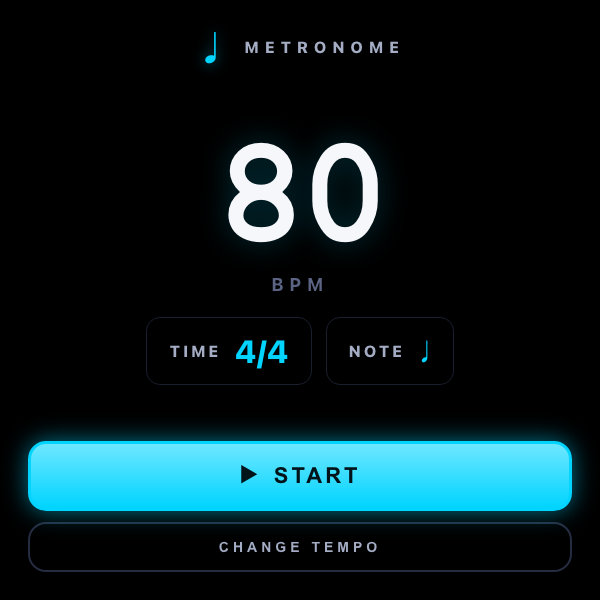
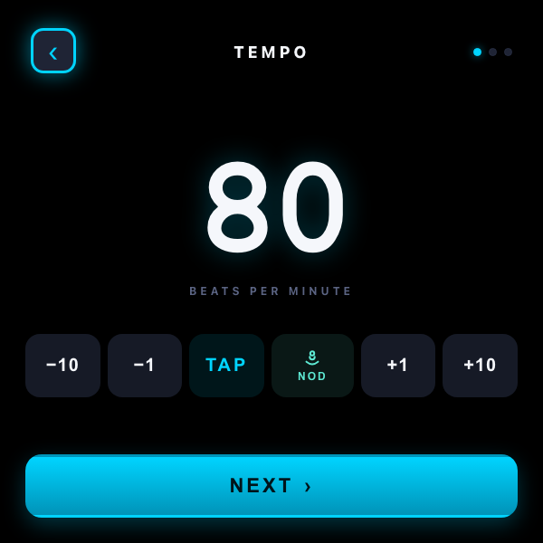
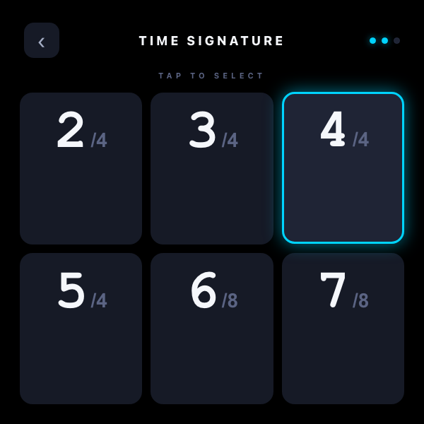
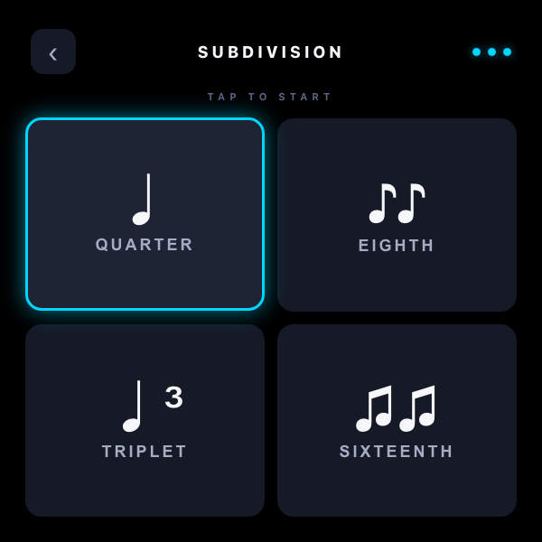
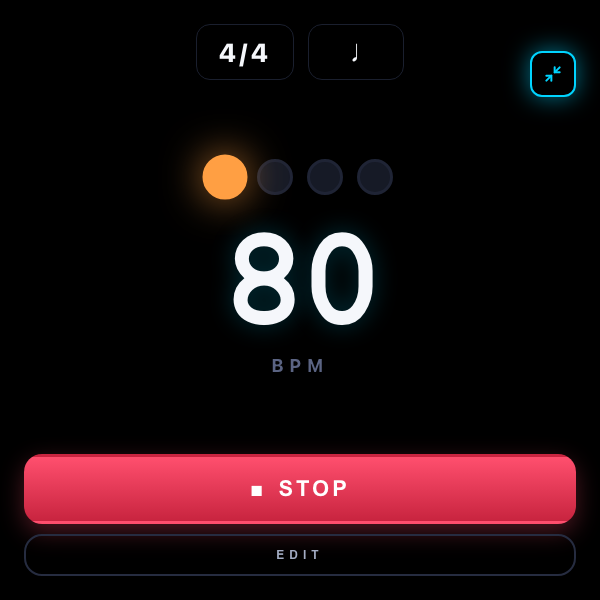
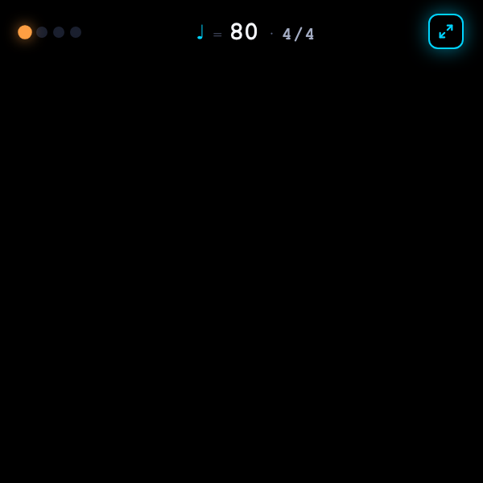

# Metronome

A hands-free metronome for Meta Display glasses — set tempo, time signature, and subdivision in three large, single-question steps, then either keep the full readout up or collapse it to a **single 64px strip** at the top of the lens so the rest of your view stays clear. Tap a button, **tap your foot**, or **nod your head** to dial in BPM.

> 📖 **Case study:** [levinriegner.com/work/metronome](https://www.levinriegner.com/work/metronome/)

---

## What it does

- **Step-by-step wizard.** Three screens, each with one job: TEMPO, TIME SIGNATURE, SUBDIVISION. Selecting a tile on steps 2 and 3 auto-advances — no extra NEXT button to hunt for.
- **Three ways to set tempo.** ±10 / ±1 buttons, **TAP** for tap-tempo averaging, or **NOD** — a head-nod picker that listens to `deviceorientation` and counts each full down-and-back nod cycle as one tap, fed into the same averager.
- **Quick-start home.** Saved BPM / time / note shown as a card on home; **START** plays with the current config, **CHANGE TEMPO** drops into the wizard.
- **Big-mode play screen.** Time + note tags, four big beat dots that scale + glow on hit, 130px BPM that flashes cyan on each beat and warm orange on the downbeat, an expanding pulse ring behind it, and STOP + EDIT below.
- **Compact HUD mode.** A pinned 64px strip across the top of the lens — beat dots, ♩ = BPM, time signature. The rest of the 600×600 stays pure black so the wearer can see through it. Tap the expand icon or **swipe down anywhere** to return to full mode.
- **Persistent + audible UI.** Every interaction plays a short AudioContext-synthesised UI cue (`tick`, `focus`, `select`, `next`, `back`, `start`, `stop`) routed straight to `ctx.destination` so it doesn't ride the metronome volume gain. Tempo / time / subdivision / compact-mode preferences persist in `localStorage`.

All metronome clicks are synthesised on the fly as 28ms damped sinusoids — 1500 Hz on the accent, 1050 Hz on regular beats, 700 Hz on subdivisions — scheduled with a 120ms lookahead so timing stays rock-solid.

---

## Controls

| Where | Input | Result |
| --- | --- | --- |
| Home | ▲ ▼ | Focus START / CHANGE TEMPO |
| Home | ◀ ▶ | Nudge BPM ±1 |
| Home | Enter | Open focused option |
| Tempo step | ◀ ▶ buttons | Adjust BPM by ±1 / ±10 |
| Tempo step | TAP | Add one beat to the running tap-tempo average |
| Tempo step | NOD | Toggle head-nod listening (one nod = one tap) |
| Tempo step (focus on row) | Swipe ▲ | Jump to BACK arrow |
| Tempo step (focus on row) | Swipe ▼ | Jump to NEXT button |
| Time / Subdivision | ▲ ▼ | Move between rows (3-col / 2-col grid) |
| Time / Subdivision | ◀ ▶ | Move between columns |
| Time / Subdivision | Enter / tap tile | Auto-select + advance |
| Playing (full) | ▲ ▼ | Focus expand-icon / STOP / EDIT |
| Playing (full) | ◀ ▶ | Nudge BPM ±1 |
| Playing (full) | EDIT | Return to TEMPO step with NOD pre-focused |
| Playing (any) | Tap expand-icon | Toggle compact ↔ full mode |
| Playing (compact) | Swipe ▼ anywhere | Expand back to full mode |

Horizontal swipes mirror ◀ ▶ for BPM on the home and play screens.

---

## Screenshots

### Home

| Saved config + START |
| --- |
|  |

### Wizard

| 1 · TEMPO | 2 · TIME SIGNATURE | 3 · SUBDIVISION |
| --- | --- | --- |
|  |  |  |

### Playing

| Full mode (downbeat accent) | Compact HUD mode |
| --- | --- |
|  |  |

---

## Running locally

The app is a single static HTML/CSS/JS bundle — no build step.

```bash
npx serve -l 4209 metronome
# then open http://localhost:4209
```

For development inside the meta-display-glasses-webapps workspace it's also wired into `.claude/launch.json` as the `metronome` preview target on port **4209**.

### Regenerating screenshots

> 🛠️ **Developer tooling only.** The app itself has zero Chrome dependency — it's vanilla HTML/CSS/JS that runs in the Ray-Ban Meta Display's built-in browser. The block below is just the local recipe used on a Mac to refresh the PNGs in `screenshots/`.

The screenshots above are produced from headless Chrome against the `?state=…` URL parameter the app reads on load:

```bash
npx serve -l 4309 metronome &
CHROME="/Applications/Google Chrome.app/Contents/MacOS/Google Chrome"
for STATE in home step-tempo step-time step-note \
             playing-full playing-small; do
  "$CHROME" --headless --disable-gpu --hide-scrollbars \
    --window-size=600,600 --virtual-time-budget=3000 \
    --screenshot="metronome/screenshots/$STATE.png" \
    "http://localhost:4309/?state=$STATE"
done
```

---

## Files

```
metronome/
├── index.html      # home, wizard steps, play screen (full + compact)
├── styles.css      # 600×600 pure-black HUD; cyan focus + warm-orange accent
├── app.js          # state machine, audio engine, nod detector, swipe/d-pad
├── favicon.svg     # cyan quarter note on black
└── screenshots/    # generated state captures used by this README
```

---

<sub>Made by Alex Levin at [L+R](https://www.levinriegner.com).</sub>
