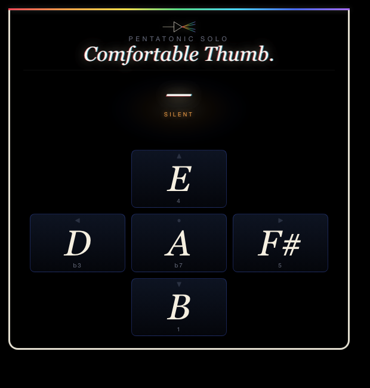

# Comfortable Thumb.

A thumb-controlled pentatonic solo synth for the Ray-Ban Meta Display. Locked to **B minor pentatonic** — the key David Gilmour solos in on *Comfortably Numb* — so every press is in-scale. Tap a key, the note rings out for ~3.5 seconds; tap a new key and the previous note fades.

| | |
|---|---|
|  |  |
| **Idle** — black void, white straight scope line. | **Playing** — chromatic note readout, thick rainbow waveform, prism particles bursting from the active pad. |

## Controls

Five keys map to the five notes of B minor pentatonic:

| Key      | Note  | Scale degree |
|----------|-------|--------------|
| ↓ Down   | **B**  | 1   (root)   |
| ← Left   | **D**  | b3           |
| ↑ Up     | **E**  | 4            |
| → Right  | **F#** | 5            |
| ⏎ Enter  | **A**  | b7           |

Hold doesn't matter — each press auto-rings for a few seconds. A new press quick-fades the previous note.

## Play along

Backing track (Comfortably Numb without the guitar) — click to open on YouTube:

Press play, then follow the notes below. Each parenthesized group is the notes for the preceding syllables. Notes are written as their letter names — match them to the keys in the table above.

---

### Verse 1 (Roger Waters)

Hel-lo (B — B)

Is there (B — B) an-y-bod-y (A — A — B — A) in there? (F# — F#)

Just nod (B — B) if you can (A — A — B) hear me (A — F#)

Is there (B — B) an-y-one (A — A — B) at home? (A — F# — F#)

Come on (B — B) now (A)

I hear (B — B) you're feel-ing (A — A — B) down (A — F#)

Well I (B — B) can ease (A — A) your pain (F# — F#)

And get you (B — B — B) on your feet (A — A — B) a-gain (A — F# — F#)

Re-lax (B — B)

I'll need some (B — B — B) in-for-ma-tion (A — A — A — A) first (F# — F#)

Just the (B — B) ba-sic facts (A — A — F#)

Can you (B — B) show me (A — A) where it hurts? (F# — F# — F#)

### Chorus 1 (David Gilmour)

There is (A — A) no pain (F# — F#) you are (E — D) re-ced-ing (E — F# — D)

A dis-tant (A — A — F#) ship smoke (F# — E) on the (D — D) ho-ri-zon (E — F# — D)

You are (A — A) on-ly (A — F#) com-ing (F# — E) through in (D — D) waves (E — F#)

Your lips (D — D) move (D) but I (D — D) can't hear (B — B) what you're (A — A) say-ing (F# — F#)

When I (D — D) was a (D — D) child I (B — B) had a (A — A) fe-ver (F# — F#)

My hands (D — D) felt just (D — D) like two (B — B) bal-loons (A — F# — F#)

Now I've (D — D) got that (D — D) feel-ing (B — B) once a-gain (A — A — F# — F#)

I can't (D — D) ex-plain (D — D) you would (B — B) not un-der-stand (A — A — F# — F# — E)

This is (D — D) not how (D — D) I am (B — A)

I (F#) have (F#) be-come (F# — F#) com-fort-a-bly (F# — F# — E — D) numb (D)

### First Guitar Solo (pentatonic adjusted)

- **Phrase 1:** D — F# — A
- **Phrase 2:** F# — E — D — E — F#
- **Phrase 3:** A — F# — E — D — A
- **Phrase 4:** A — D — E — F# — A — B — A
- **Phrase 5:** F# — A — B — A
- **Phrase 6:** F# — E — D
- **Phrase 7:** E — F# — E — D — B — A
- **Phrase 8:** A — D — E — F# — A — B — A
- **Phrase 9:** D — B — A — F# — E — D — D

### Verse 2 (Roger Waters)

O.K. (B — B)

Just a (B — B) lit-tle pin (A — A — B) prick (A — F# — F#)

There'll be no (B — B — B) more a-a-a-a-ah! (A — A — F# — F# — E — D)

But you (B — B) may feel a (A — A — A) lit-tle sick (F# — F# — F#)

Can you (B — B) stand up? (A — A — F# — F#)

I do (B — B) be-lieve it's (A — A — A) work-ing, good (F# — F# — F#)

That'll keep you (B — B — B — B) go-ing through (A — A — A) the show (F# — F#)

Come on (B — B) it's time (A — A) to go (F# — F#)

### Chorus 2 (David Gilmour)

There is (A — A) no pain (F# — F#) you are (E — D) re-ced-ing (E — F# — D)

A dis-tant (A — A — F#) ship smoke (F# — E) on the (D — D) ho-ri-zon (E — F# — D)

You are (A — A) on-ly (A — F#) com-ing (F# — E) through in (D — D) waves (E — F#)

Your lips (D — D) move (D) but I (D — D) can't hear (B — B) what you're (A — A) say-ing (F# — F#)

When I (D — D) was a (D — D) child (B)

I caught (A — A) a fleet-ing (F# — F# — F#) glimpse (E — D)

Out of (D — D) the cor-ner (D — D — B) of my (A) eye (F# — F#)

I turned (D — D) to look (D — D) but it (B — B) was gone (A — A — F# — F#)

I can-not (D — D — D) put my (B — B) fin-ger (A — A) on it (F# — F#) now (E — D)

The child (D — D) is grown (D — D)

The dream (B — B) is gone (A — F# — F#)

I (F#) have (F#) be-come (F# — F#) com-fort-a-bly (F# — F# — E — D) numb (D)

### Second Guitar Solo / Outro (pentatonic adjusted)

Bends are noted but the synth doesn't pitch-bend — play the target note instead.

- **Phrase 1:** B (bend to D) — A — F#
- **Phrase 2:** D — E (bend to F#) — E — D — B
- **Phrase 3:** B — D — E — F# — A — B
- **Phrase 4:** B (bend to D) — B — A — F#
- **Phrase 5:** F# — A — B (bend to D) — B — A
- **Phrase 6:** B — D — E (bend to F#) — E — D — B
- **Phrase 7:** B — A — F# — E — D — B — A — F# — E — D — B
- **Phrase 8:** D — E — F# — A — B (bend to D) — B — A
- **Phrase 9:** F# — A — B (bend to D) — B (bend to D) — B (bend to D)
- **Phrase 10:** F# — A — B — D — E — F# — A — B
- **Phrase 11:** B (bend to D) — A — F# — E — D — B
- **Phrase 12:** D — E (bend to F#) — E — D — B

---

## Under the hood

- **Synth:** Web Audio API. Each note is a sawtooth + slightly detuned square through a per-voice lowpass with a wah-ish attack sweep (900→3200→1600 Hz), into a soft-saturation waveshaper and a 430ms tape-delay loop with feedback for Gilmour space.
- **Visuals:** A full-screen canvas with `mix-blend-mode: screen` bursts 36 rainbow particles from the pressed pad and trickles sparkles while the note rings. The scope shows a thin white line at rest and a thick red→violet waveform when ringing.
- **Stack:** Vanilla HTML/CSS/JS, no dependencies. Built for the Ray-Ban Meta Display 600×600 viewport.

Local dev server: `npx serve -l 4222 pentatonic-solo` (or use the `pentatonic-solo` entry in `.claude/launch.json`). Add `?demo=down` (or `left`, `up`, `right`, `enter`) to the URL to auto-play a note 600ms after load — handy for screenshots.
