# Pinout HUD

A heads-up display for Meta Display glasses that keeps the four things you need while soldering an ESP32 in your right peripheral vision — **pin number, label, wire colour, and a glanceable schematic**. Drive every screen with directional swipes plus a tap; never put the iron down to check a datasheet.

> 📖 **Case study:** [levinriegner.com/work/pinout-hud](https://www.levinriegner.com/work/pinout-hud/)

---

## What it does

- **Four ESP32 templates built in.** WROOM-32, CAM, ESP8266 NodeMCU, and S3-Mini ship with sensible default wire colours (GND→black, 3V3→red, GPIO→blue, TX→green, RX→yellow, SPI→purple / white). Pick a board, optionally cycle any pin's colour, finalize.
- **Custom-board flow without typing.** A 5 × 9 spatial grid of the most common pin labels (power · control · I²C · SPI · GPIO0–39 · analog / digital). Swipe to land on any label in ≤4 moves, tap to confirm. The wire-colour step is a separate screen with the conventional colour pre-focused, so the typical pin commits in two taps.
- **Active reference HUD.** Right-aligned vertical pin list, each row with a glowing wire stub + terminal end-cap so the colours read as schematic chrome, not screen junk.
- **Focus Mode.** Right-swipe from the reference list to zoom the selected pin huge in the centre-right while the rest dims to 18 % — so when your hands are busy you can't solder the wrong pad.
- **Subtle PCB-trace flourishes.** A background `<canvas>` paints five thin polylines along the left gutter + corners, with a slow accent "current" pulse sliding each trace on its own loop. Pure decoration; never overlaps active content.
- **Right-weighted lens layout.** `--pad-l: 160px` parks every screen against the right side of the 600 × 600 lens so the user sees content where their projected display actually is.

---

## Controls

| Where | Input | Result |
| --- | --- | --- |
| Home | ▲ ▼ | Focus ESP32 / CUSTOM / REPLAY TUTORIAL |
| Home | Enter | Open focused option |
| ESP32 list | ▲ ▼ | Cycle boards |
| ESP32 list | Enter | Select board → wire-colour assign |
| Wire-colour assign | ▲ ▼ | Cycle pins |
| Wire-colour assign | Enter | Cycle wire colour of focused pin |
| Wire-colour assign | ◀ ▶ | Move to BACK / FINALIZE |
| Custom pin count | ◀ ▶ | Focus − / + |
| Custom pin count | Enter | Decrement / increment count (or confirm on START) |
| Label grid | ▲ ▼ ◀ ▶ | Move across the 5 × 9 grid |
| Label grid | Enter | Pick label → wire-colour step |
| Wire-colour step | ▲ ▼ ◀ ▶ | Move across the 8-colour grid |
| Wire-colour step | Enter | Pick colour → next pin (or finalize) |
| Reference HUD | ▲ ▼ | Step selected pin |
| Reference HUD | ▶ | Enter Focus Mode |
| Reference HUD | ◀ | Move focus to HOME button |
| Focus Mode | ▲ ▼ | Step pin |
| Focus Mode | ◀ | Exit Focus Mode |

Browser preview maps **arrow keys** to swipes and **Enter / Space** to tap so the whole app rehearses at a desk.

---

## Screenshots

### Home & onboarding

| Default | Three-step walkthrough |
| --- | --- |
| 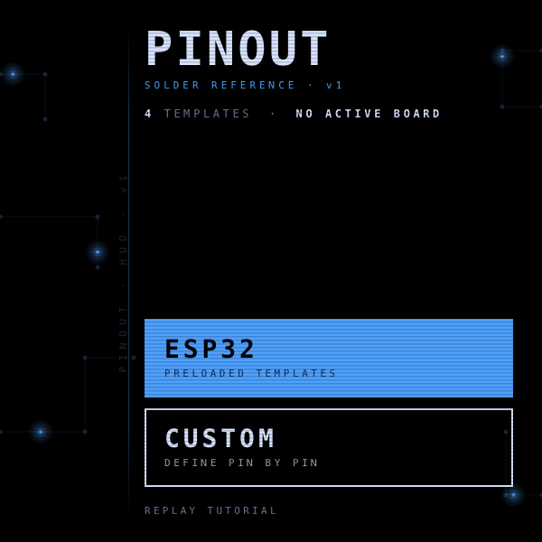 | 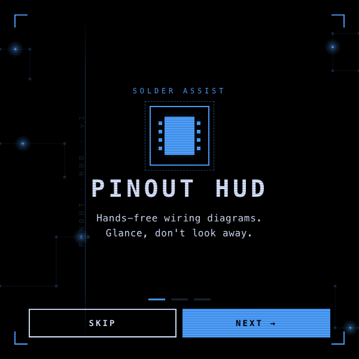 |

### ESP32 template flow

| Board picker | Wire-colour assign | Reference HUD | Focus Mode |
| --- | --- | --- | --- |
| 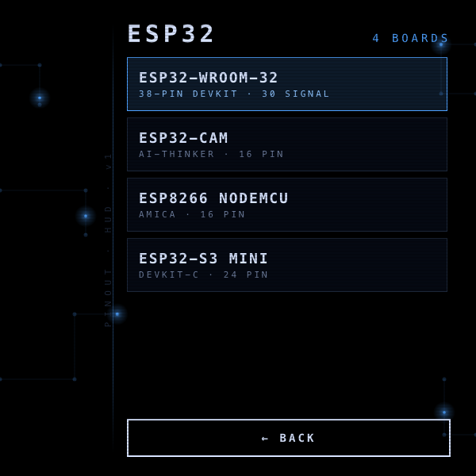 | 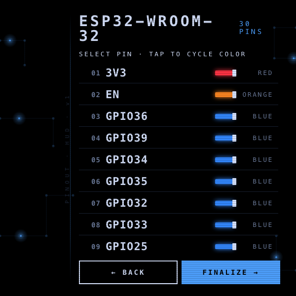 | 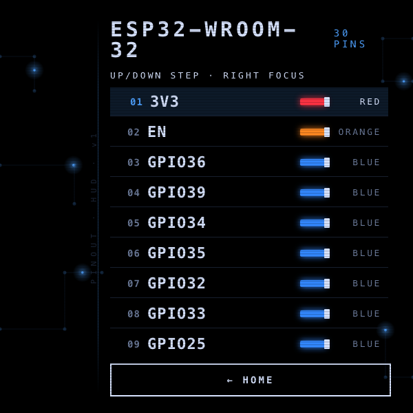 | 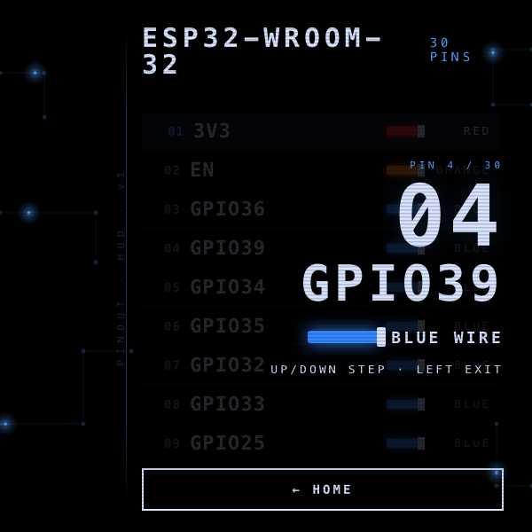 |

### Custom-board flow

| Pin count | Pin 1 · label grid | Pin 1 · wire colour | Pin 2 · label grid |
| --- | --- | --- | --- |
| 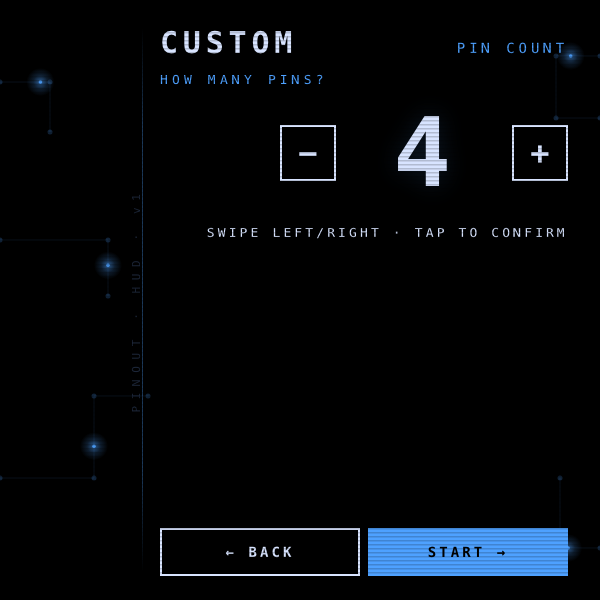 | 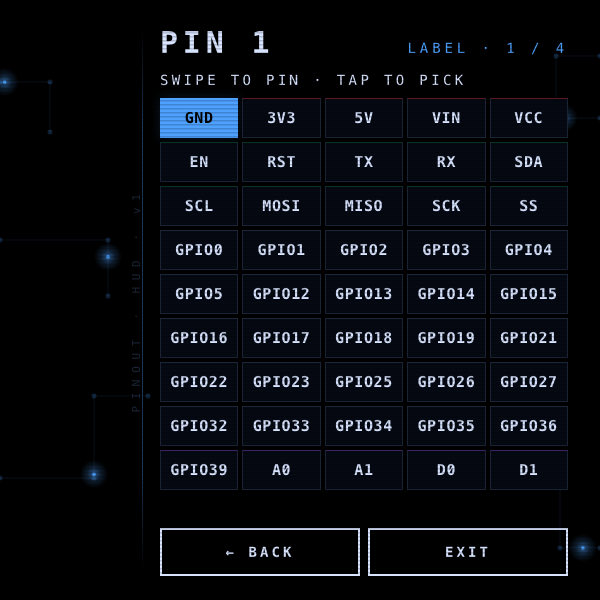 |  | 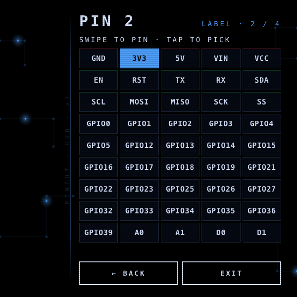 |

| Pin 2 · wire colour | Finalized 4-pin board |
| --- | --- |
| 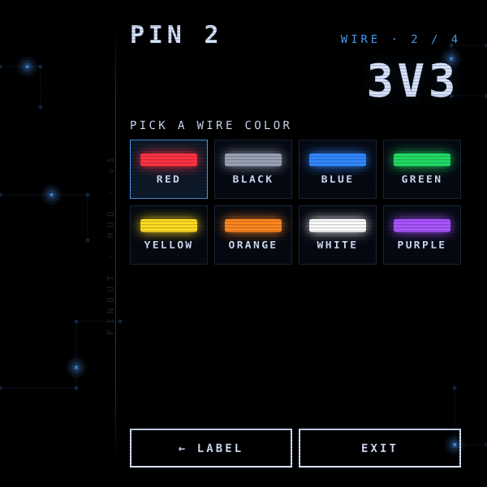 | 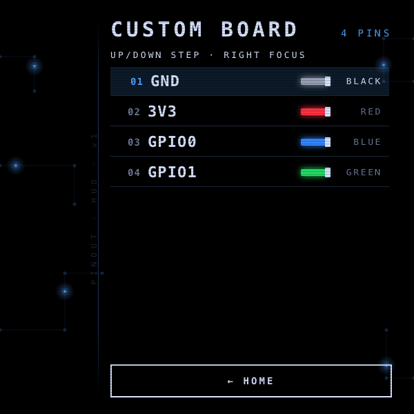 |

---

## Running locally

The app is a single static HTML/CSS/JS bundle — no build step.

```bash
npx serve -l 4208 pinout-hud
# then open http://localhost:4208
```

For development inside the `meta-display-glasses-webapps` workspace it's also wired into `.claude/launch.json` as the `pinout-hud` preview target on port **4208**.

### Regenerating screenshots

> 🛠️ **Developer tooling only.** The app itself has zero Chrome dependency — it's vanilla HTML/CSS/JS that runs in the Ray-Ban Meta Display's built-in browser. The block below is just the local recipe used on a Mac to refresh the PNGs in `screenshots/`.

The screenshots above are produced from headless Chrome against the `?state=…` URL parameter the app reads on load:

```bash
npx serve -l 4308 pinout-hud &
CHROME="/Applications/Google Chrome.app/Contents/MacOS/Google Chrome"
for STATE in home walkthrough esp32-list esp32-color-assign \
             esp32-reference focus-mode custom-count \
             custom-label-1 custom-color-1 custom-label-2 \
             custom-color-2 custom-reference; do
  "$CHROME" --headless --disable-gpu --hide-scrollbars \
    --window-size=600,600 --virtual-time-budget=3000 \
    --screenshot="pinout-hud/screenshots/$STATE.png" \
    "http://localhost:4308/?state=$STATE"
done
```

---

## Files

```
pinout-hud/
├── index.html      # 8 screens + toast + confirm overlay
├── styles.css      # 600×600 right-aligned HUD; schematic blue + neon wire palette
├── app.js          # state machine, focus mode, canvas init, ?state= routing
├── data.js         # 4 ESP32 templates, 5×9 label grid, default wire colours
└── screenshots/    # generated state captures used by this README
```

---

<sub>Made by Alex Levin at [L+R](https://www.levinriegner.com).</sub>
