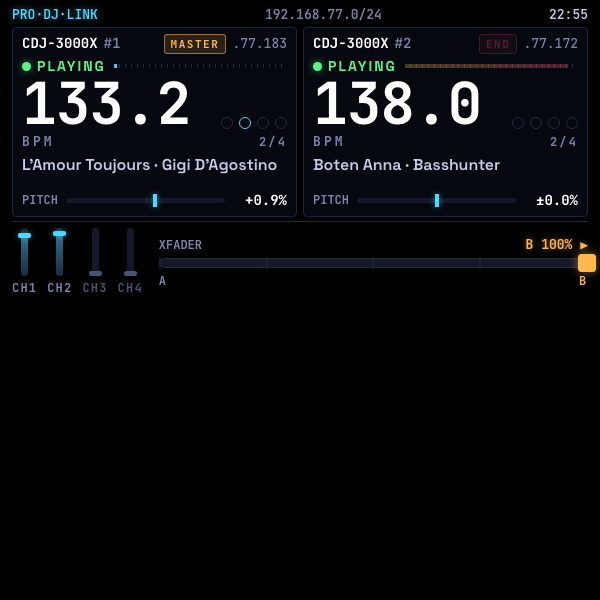
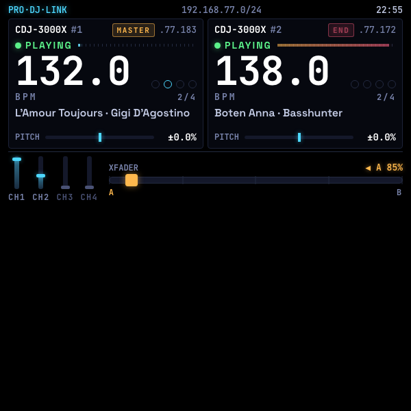
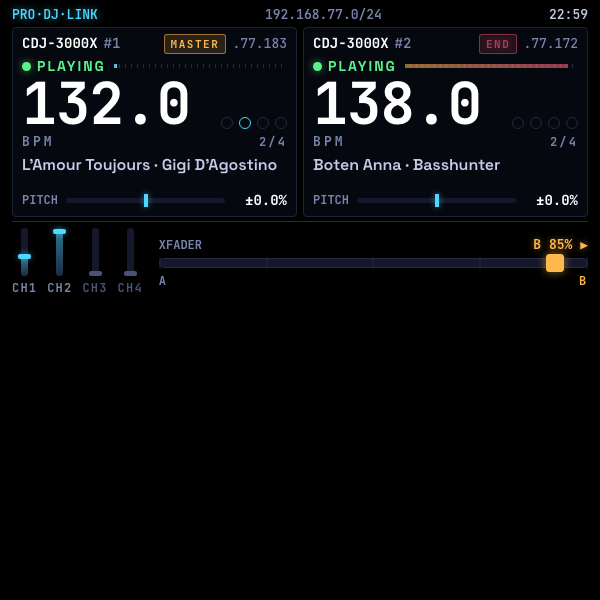
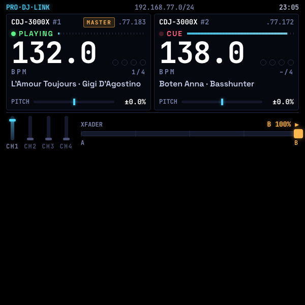

# See DJ

See DJ runs on **Pro DJ Link**, Pioneer DJ's networking protocol that connects CDJs, XDJs, and DJM mixers over a standard Ethernet cable so every device on the booth can share data in real time. Once the glasses are on the network, the display shows song title, artist, live BPM, playing status, a downbeat-aware four-step beat indicator, and pitch-fader position for each media player. **MASTER** and **SYNC** tags show which deck is driving tempo and which is following. Four channel faders render as vertical strips so you can see at a glance which channels are live on the mixer. The crossfader displays its exact position and flips amber the moment it leaves center, flagging when the room is being fed by one deck only.

**No controls, no input, no interaction required. You drive the gear. See DJ just shows you what it is doing.**

> 📖 **Case study:** [levinriegner.com/work/see-dj](https://www.levinriegner.com/work/see-dj/)
> 🌐 **Live demo:** [rbm-demos.lnr.io/see-dj](https://rbm-demos.lnr.io/see-dj/)

---

## What it does

- **Per-deck telemetry.** For every Pioneer device on the Pro DJ Link subnet the HUD surfaces unit number, IP, PLAYING / CUE / PAUSED status, live BPM, a downbeat-aware 4-step beat indicator (1/4 · 2/4 · 3/4 · 4/4), the current track (title · artist), and pitch-fader position with sign and percentage.
- **MASTER / SYNC tags.** Reads the link-master broadcast to show which deck is currently driving the tempo and which is following — and which has nothing routed at all.
- **END alert.** Any deck whose track is past 90 % gets a **blinking red `END`** badge and a red play-progress bar — a passive nudge to start the next mix before the floor goes silent.
- **Live mixer state.** Four DJM channel faders rendered as vertical strips — CH1 is wired to Deck A, CH2 to Deck B, CH3 / CH4 stay dim when nothing is routed there. You can see at a glance which channels are *up* and which are *down*.
- **Crossfader telemetry.** A wide ribbon shows the crossfader's exact position with five tick marks; the indicator flips amber and labels `◀ A 85%` or `B 85% ▶` the moment it leaves center, flagging when the room is being fed by one deck only.
- **Half-lens layout.** The HUD fills only the top 300 px of the lens; the bottom 300 px stays pure `#000`, which reads as transparent on the additive waveguide — so the dancefloor stays visible below the readout.

### Scripted demo scene

The deployed demo boots straight into a full mix-out, scripted from the kind of Pro DJ Link telemetry See DJ would receive in production:

1. **0 s** — Deck B is live to the floor with *Boten Anna · Basshunter* (138 BPM, near the end of the track — `END` is already blinking). Crossfader is pinned hard to B; CH2 is up. Deck A has just been cued with *L'Amour Toujours · Gigi D'Agostino* (132 BPM, MASTER).
2. **0 → 15 s** — Deck A's pitch ramps from 132 → 138 BPM (≈ +4.55 %), beat-matching to B.
3. **18 → 22 s** — A one-shot platter nudge slides Deck A's beat 1 onto Deck B's beat 1 so the downbeats lock.
4. **23.5 → 28.5 s** — The crossfader cosine-eases from full B over to full A — the DJ swapping the live track.
5. **28.5 s →** — Deck A is now playing out to the room; the floor never hears silence.

In a production build the same view could be driven straight from Pioneer's Pro DJ Link UDP packets or [`prolink-connect`](https://github.com/EvanPurkhiser/prolink-connect) and become a real booth display.

---

## Pro DJ Link compatibility

A standard Ethernet cable between any of the devices below puts them on a shared Pro DJ Link network where they can sync BPM, share a single USB / SD library, lock Beat FX to the track grid, and broadcast On-Air / Traffic Light status to one another.

### Media players (CDJs & XDJs)

Multi-players that can link up to share a single USB/SD card library and sync BPM:

- **Flagship series** — AlphaTheta CDJ-3000X, CDJ-3000, CDJ-TOUR1
- **Legacy club standards** — CDJ-2000NXS2, CDJ-2000NXS, CDJ-2000
- **Mid-tier & performance players** — CDJ-900NXS, CDJ-900, XDJ-1000MK2, XDJ-1000, XDJ-700

### DJ mixers

Mixers that send On-Air / Traffic Light data to the players and lock their Beat FX to the track grid:

- **Current flagships** — DJM-A9, DJM-V10
- **Legacy club standards** — DJM-900NXS2, DJM-900NXS, DJM-2000NXS, DJM-2000

### Standalone all-in-one systems

Only high-end standalones have the hardware ports to act as players or integrate with a larger linked ecosystem:

- **Fully compatible** — XDJ-AZ, OPUS-QUAD, XDJ-XZ, and the original XDJ-RX
- ❌ **Not compatible** — XDJ-RX3, XDJ-RX2, XDJ-RR (Ethernet port is strictly for computer export, or the unit lacks the infrastructure to stream multi-client link protocols)
- ❌ **Laptop controllers** — DDJ and FLX series (DDJ-1000, DDJ-FLX10, etc.) need a computer to handle data processing, so they don't speak Pro DJ Link

### Software & apps

- **rekordbox** (Mac / Windows) — connect via *Link Export Mode* to stream your computer's music library directly onto the hardware network
- **rekordbox for iOS / Android** — bridges a mobile device's music library over Wi-Fi onto the hardware network

---

## Controls

**None.** This is a passive read-only HUD — the DJ drives the gear, the glasses just report what the CDJs and mixer are doing. No D-pad input, no swipes, no Enter binding.

---

## Screenshots

| Boot — Deck B live (END blinking), Deck A cued + pitch ramping | Crossfader pushed toward Deck A | Crossfader pushed toward Deck B |
| --- | --- | --- |
|  |  |  |

| Deck B cued (channel dropped) | Pitched (Deck A +2.4 %, Deck B −1.8 %) |
| --- | --- |
|  |  |

---

## Running locally

The app is a single static HTML/CSS/JS bundle — no build step.

```bash
npx serve -l 4220 see-dj
# then open http://localhost:4220
```

### Regenerating screenshots

> 🛠️ **Developer tooling only.** The app itself has zero Chrome dependency — it's vanilla HTML/CSS/JS that runs in the Ray-Ban Meta Display's built-in browser. The block below is just the local recipe used on a Mac to refresh the PNGs in `screenshots/`.

The screenshots above are produced from headless Chrome against the `?state=…` URL parameter the app reads on load:

```bash
npx serve -l 4220 see-dj &
CHROME="/Applications/Google Chrome.app/Contents/MacOS/Google Chrome"
for STATE in home crossfade-a crossfade-b cue pitched; do
  "$CHROME" --headless=new --disable-gpu --hide-scrollbars \
    --window-size=600,600 --virtual-time-budget=3000 \
    --screenshot="see-dj/screenshots/$STATE.png" \
    "http://localhost:4220/?state=$STATE"
done
```

---

## Files

```
see-dj/
├── index.html      # top-half HUD: 2 decks + 4-ch mixer + crossfader
├── styles.css      # 600×300 black booth telemetry; cyan + jade + amber + red
├── app.js          # scripted timeline, beat clock, pitch ramp, END alert, ?state= routing
├── favicon.svg     # cyan jog-wheel mark
└── screenshots/    # generated state captures used by this README
```

<sub>Made by Alex Levin at [L+R](https://www.levinriegner.com).</sub>
