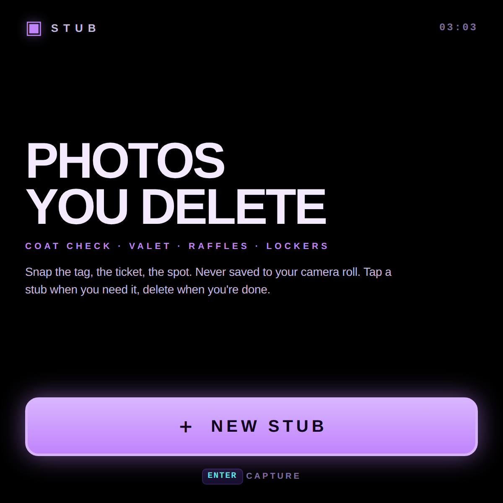
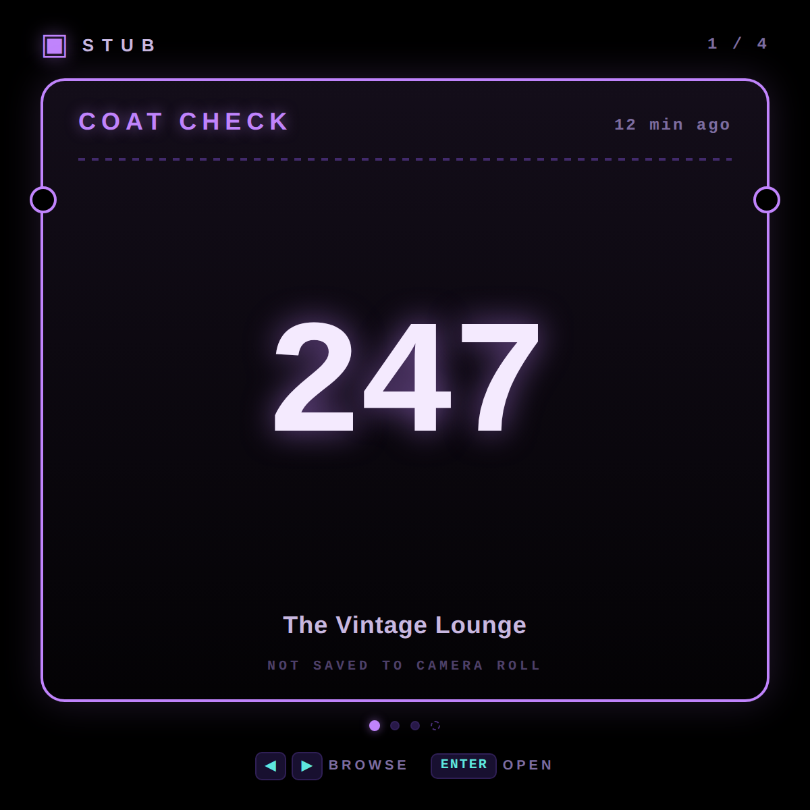
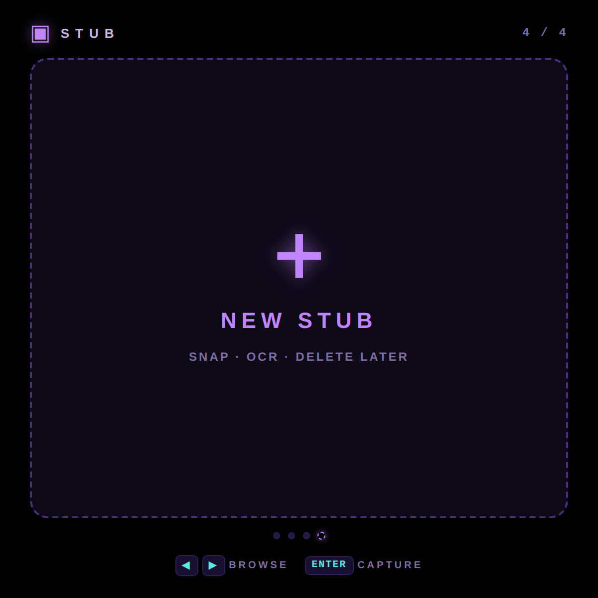
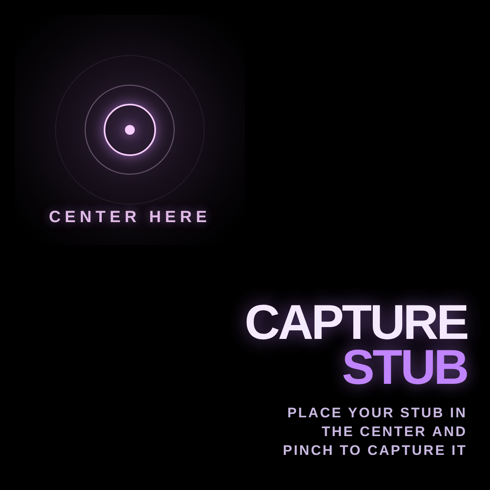
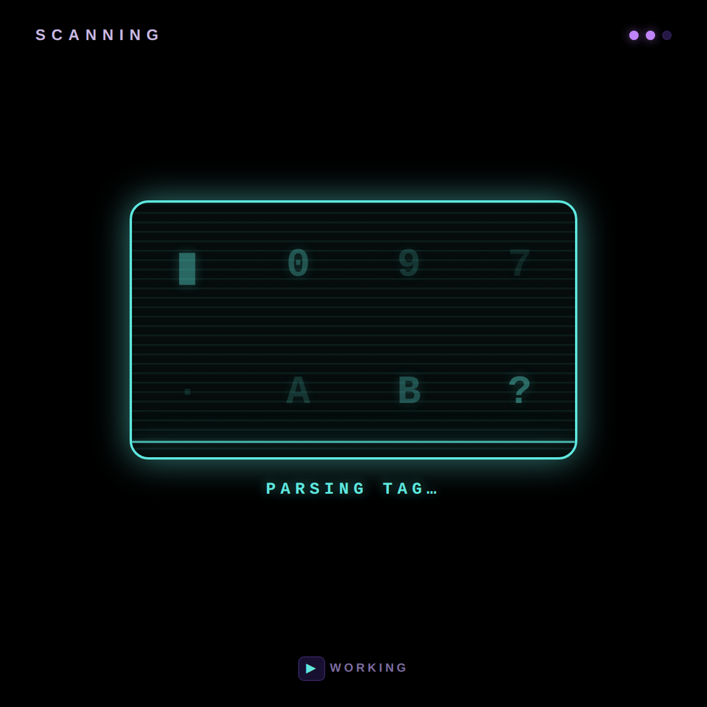
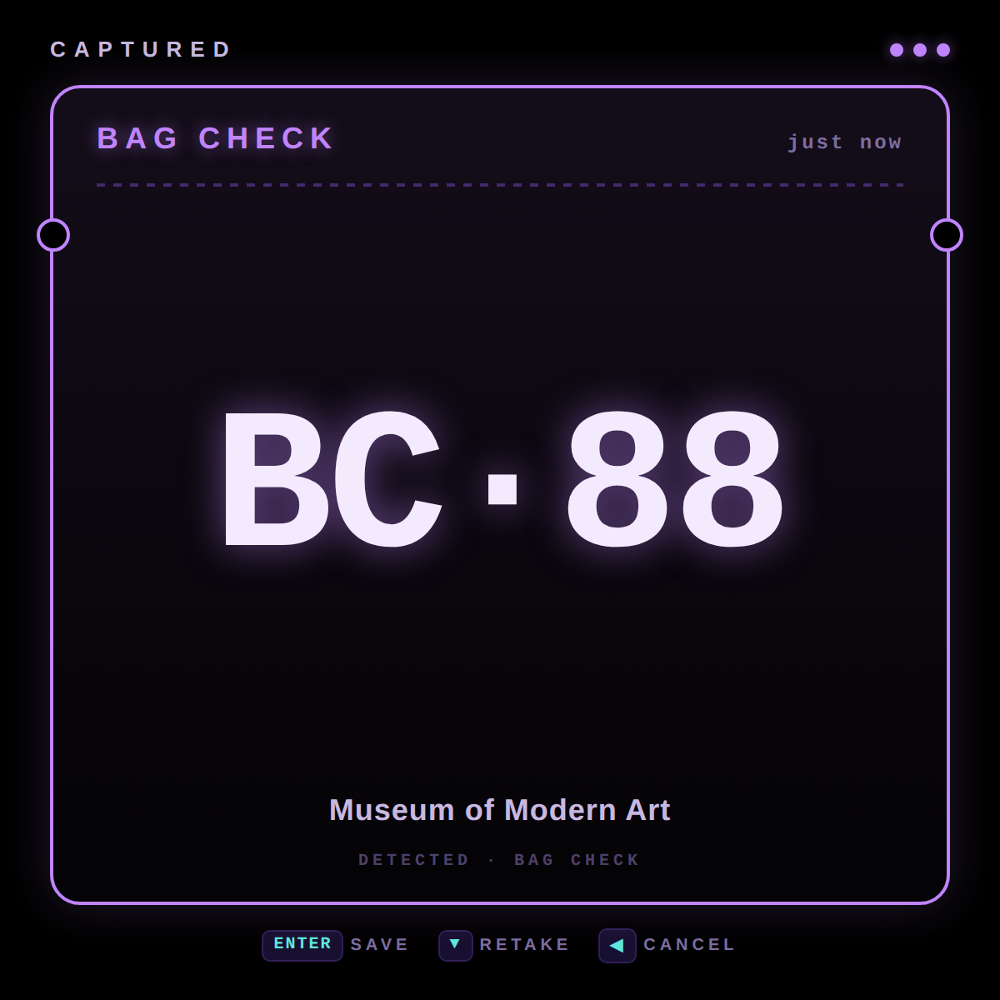
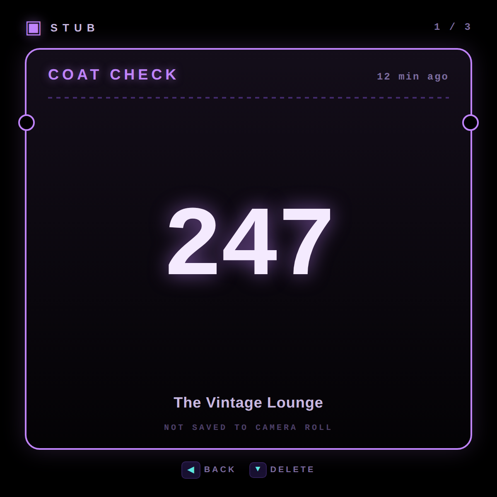
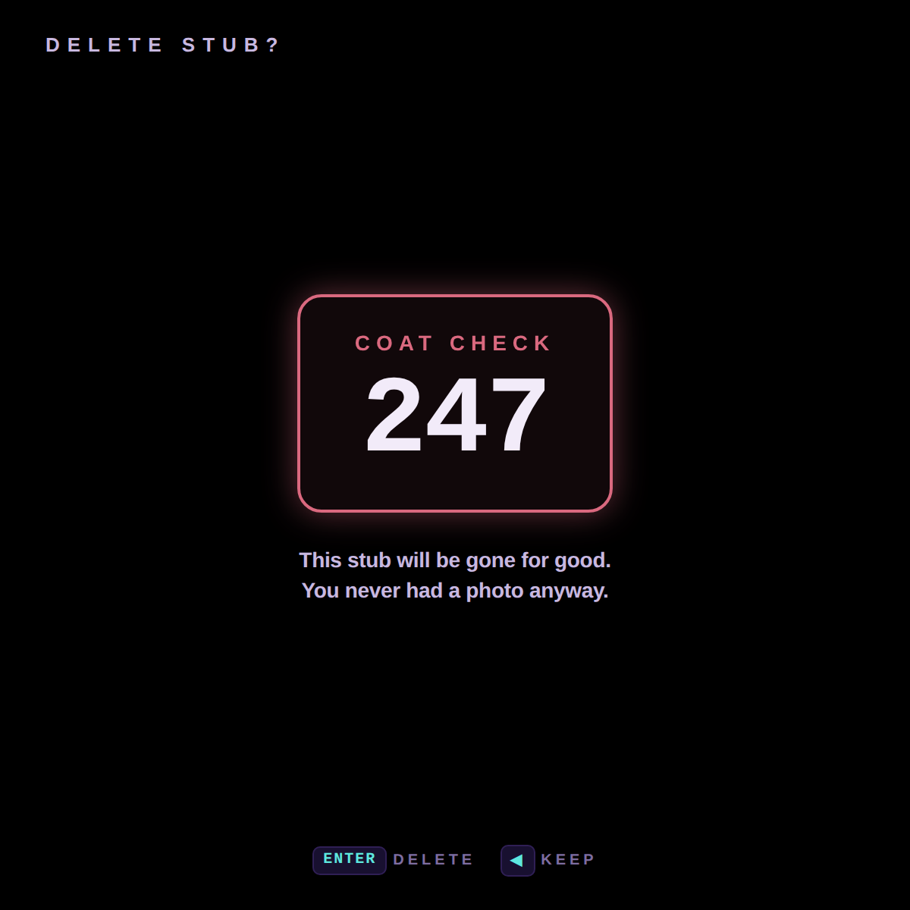

# Stub

A "photo notes" app for the Meta Display glasses — for the ephemeral receipts of daily life. **Snap the coat-check tag, the valet ticket, the locker number, the raffle stub.** The capture never goes to your camera roll. It lives in this app until you delete it.

Designed for the 600×600 lens, driven by the D-pad. The camera lives on the right temple, so the capture screen highlights the **top-left quadrant** of the display — that's the sweet spot where a tag held in front of the wearer lands centered in the camera frame.

---

## What it does

- **One-screen capture.** The "New Stub" screen *is* the camera screen — a semi-translucent purple zone in the top-left of the lens, breathing and scanning, tells you *where* to frame the tag. A giant **PINCH TO CAPTURE** in the bottom-right tells you *how*. No intermediate aim step, no preview.
- **OCR pass** reads the tag and pulls out **category, code, and venue** so you never have to squint at the photo later. (The demo cycles through a built-in pool of realistic tickets; production wires up Tesseract or a small vision model.)
- **No camera roll.** Stubs live inside this app, scoped to its localStorage. They never touch Photos / Gallery, so the volunteer who hands you a numbered cardboard square in 2026 doesn't leak into your year-in-review.
- **Carousel of saved stubs.** ◀ ▶ to flip through them; the latest is always first. A `+ NEW STUB` sentinel sits at the end of the carousel.
- **One-tap delete** with a confirmation that reminds you the photo was never there to keep.

### What it's for

The kind of micro-receipt you'd otherwise photograph "just in case" and then have rotting at the top of your camera roll for six months:

- **Coat check** · the perforated cardboard tag
- **Valet** · the carbon-paper duplicate
- **Bag check** · museum, theater, ski-resort
- **Raffle / drawing** · "keep this half"
- **Parking spot** · `P3 · Row 12 · Space 412`, garage signage
- **Hotel room number** · written on the keycard sleeve so you remember after dinner
- **Locker** · gym, pool, spa, sauna, country club
- **Restaurant table / pager** · the brick that buzzes when your table's ready
- **Order pickup** · deli counter, pharmacy, hardware store, butcher
- **Rental car license plate** · so you can find it in row 47 of the airport lot
- **Apartment buzzer code** · the airbnb taped-to-the-fridge slip
- **Storage unit / unit access code**
- **Conference badge number / booth number**
- **Wristband ID** · festival, hospital, theme park
- **Dry cleaner / shoe repair / camera repair tickets**
- **Boat slip · marina · campsite · RV pad · ski lift pass**
- **Wine bottle label** · the one you liked at dinner
- **Whiteboard from a meeting** · "I'll re-photograph that later" except you actually want to delete it later
- **Pet collar tag** · when you find a wandering dog
- **WiFi password handwritten on a cafe chalkboard**
- **Medication label** · the dose you want to remember to refill
- **Business card** · when you don't actually want it in your contacts

Anything you'd photograph as a private bookmark and then wish you could un-photograph.

---

## Controls

| Where | Input | Result |
| --- | --- | --- |
| Home (empty) | Enter | Start a new capture |
| Home (carousel) | ◀ ▶ | Flip between saved stubs and the `+ NEW STUB` slot |
| Home (carousel) | Enter | Open the focused stub, or capture if `+ NEW STUB` is focused |
| Capture | Enter (= pinch on-device) | Snap & scan |
| Capture | ◀ | Cancel back to home |
| Scanning | ◀ | Bail out before the OCR resolves |
| Captured | Enter | Save the stub |
| Captured | ▼ | Retake |
| Captured | ◀ | Discard and go home |
| Detail | ◀ or Enter | Back to home |
| Detail | ▼ | Delete… |
| Delete confirm | Enter | Delete for good |
| Delete confirm | ◀ | Keep it |

All inputs that exist on the device: D-pad arrows + Enter. No keyboard, no on-screen tap targets, no `×` close button — the controls map directly to what the glasses can do.

---

## Screenshots

### Home

| First run — empty | Carousel of saved stubs | `+ NEW STUB` slot |
| --- | --- | --- |
|  |  |  |

### Capture flow

| Capture — pinch to snap | Scanning · OCR | Captured · save or retake |
| --- | --- | --- |
|  |  |  |

### Manage

| Saved stub detail | Delete confirmation |
| --- | --- |
|  |  |

---

## Running locally

The app is a single static HTML/CSS/JS bundle — no build step.

```bash
npx serve -l 4321 stub
# then open http://localhost:4321
```

Use ←→↑↓ + Enter to drive it. Stubs persist across reloads in `localStorage`; clear that key to reset to the seeded carousel.

### Regenerating screenshots

> 🛠️ **Developer tooling only.** The app itself has zero Chrome dependency — it's vanilla HTML/CSS/JS that runs in the Ray-Ban Meta Display's built-in browser. The block below is just the local recipe used on a Mac to refresh the PNGs in `screenshots/`.

Screenshots come from headless Chrome against the `?state=…` URL parameter the app reads on load:

```bash
npx serve -l 4321 stub &
CHROME="/Applications/Google Chrome.app/Contents/MacOS/Google Chrome"
for STATE in home-empty home home-new capture scanning confirm detail delete; do
  "$CHROME" --headless --disable-gpu --hide-scrollbars \
    --window-size=600,600 --virtual-time-budget=2000 \
    --screenshot="stub/screenshots/$STATE.png" \
    "http://localhost:4321/?state=$STATE"
done
```

---

## Files

```
stub/
├── index.html      # all 7 screens (empty home, home carousel, capture, scanning, confirm, detail, delete)
├── styles.css      # 600×600 purple + cyan; ticket-stub card with side notches
├── app.js          # state machine, localStorage persistence, demo OCR pool
├── favicon.svg     # purple stub w/ a perforated middle
└── screenshots/    # generated state captures used by this README
```

---

<sub>Made by Alex Levin at [L+R](https://www.levinriegner.com).</sub>
