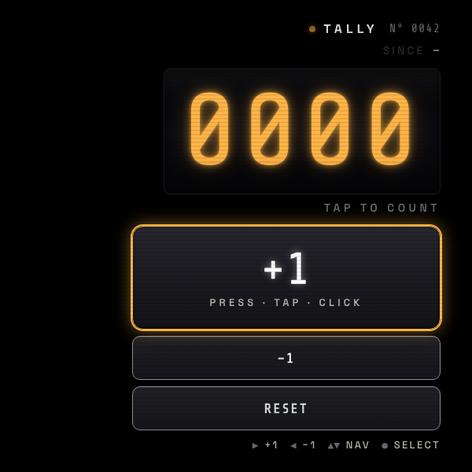

# Tally Counter

A heads-up hand-tally-counter for Meta Display glasses. One **big +1 target**, a **glanceable 4-digit LED**, and a **light click** every time you count up — so you can keep your eyes on whatever you're counting (knitting rows, push-ups, foot traffic, kids on a field trip) instead of on a clicker.

> 📖 **Case study:** [levinriegner.com/work/tally-counter](https://www.levinriegner.com/work/tally-counter/)

---

## What it does

- **One-button counting.** The big **+1** button fills most of the lens; tap, click, or press Enter/Space/▶ to increment. A short Web-Audio click confirms each count without you having to look down.
- **0000–9999 LED display.** Tabular amber digits with a ghost-`8888` back-layer, just like a 7-segment LCD. Tick flash on +1, dim flash on −1, red pulse if you hit the 9999 ceiling.
- **−1 to correct miscounts.** Sits directly below +1 in the stack; a slightly lower-pitched click distinguishes it from +1 by ear.
- **RESET with confirmation.** Destructive, so it's gated by a red-bordered "0042 → 0000" overlay with Cancel focused by default. A descending two-tone chime plays on confirm.
- **Since-timestamp.** Captures `HH:MM` of the first count after each reset so you can see how long the current run has been going.
- **Persisted.** Count + since-timestamp survive reloads via `localStorage` (`mdg_tally_v1`).

All audio is synthesised at runtime through the Web Audio API — no asset files, no autoplay-policy traps (the first user interaction unlocks the context).

---

## Controls

| Where | Input | Result |
| --- | --- | --- |
| Anywhere | ▶ Right | +1 |
| Anywhere | ◀ Left | −1 |
| Anywhere | ▲ ▼ Up / Down | Move focus through +1 → −1 → RESET |
| Anywhere | Enter / Space / ● | Activate the focused button |
| Anywhere | Tap / click | Activate the tapped button |
| Anywhere | R | Open the reset confirmation |
| Reset confirm | ◀ ▶ / ▲ ▼ | Toggle CANCEL ↔ RESET |
| Reset confirm | Enter / Space | Activate focused option |
| Reset confirm | Esc | Close the overlay |

Every action has a focused button and a key shortcut — tapping a button is equivalent to pressing its key. There are no swipe gestures.

---

## Screenshots

### Counting

| Idle — 0000 | Mid-run — 0137, SINCE 22:30 |
| --- | --- |
|  |  |

### Reset confirmation

| 0042 → 0000 |
| --- |
|  |

---

## Running locally

The app is a single static HTML/CSS/JS bundle — no build step.

```bash
npx serve -l 4211 tally-counter
# then open http://localhost:4211
```

For development inside the meta-display-glasses-webapps workspace it's also wired into `.claude/launch.json` as the `tally-counter` preview target on port **4211**.

### Regenerating screenshots

> 🛠️ **Developer tooling only.** The app itself has zero Chrome dependency — it's vanilla HTML/CSS/JS that runs in the Ray-Ban Meta Display's built-in browser. The block below is just the local recipe used on a Mac to refresh the PNGs in `screenshots/`.

The screenshots above are produced from headless Chrome against the `?state=…` URL parameter the app reads on load (`idle`, `counted`, `confirm`):

```bash
npx serve -l 4211 tally-counter &
CHROME="/Applications/Google Chrome.app/Contents/MacOS/Google Chrome"
for STATE in idle counted confirm; do
  "$CHROME" --headless=new --disable-gpu --hide-scrollbars \
    --window-size=600,600 --virtual-time-budget=2500 \
    --screenshot="tally-counter/screenshots/$STATE.png" \
    "http://localhost:4211/?state=$STATE"
done
```

---

## Files

```
tally-counter/
├── index.html      # single screen + reset-confirm overlay
├── styles.css      # 600×600 right-aligned HUD; black bg, amber LED, chrome-rimmed buttons
├── app.js          # state, Web Audio click engine, keyboard nav, persistence, URL-state overrides
└── screenshots/    # generated state captures used by this README
```

---

<sub>Made by Alex Levin at [L+R](https://www.levinriegner.com).</sub>
