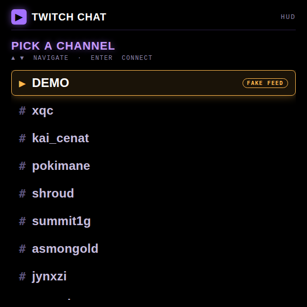
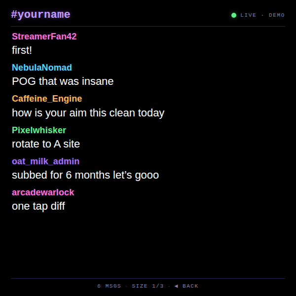
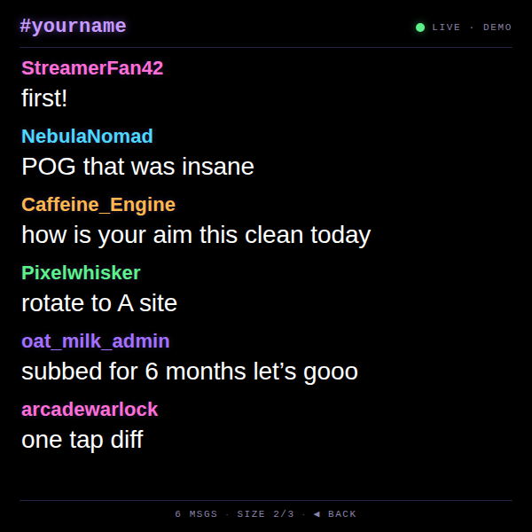
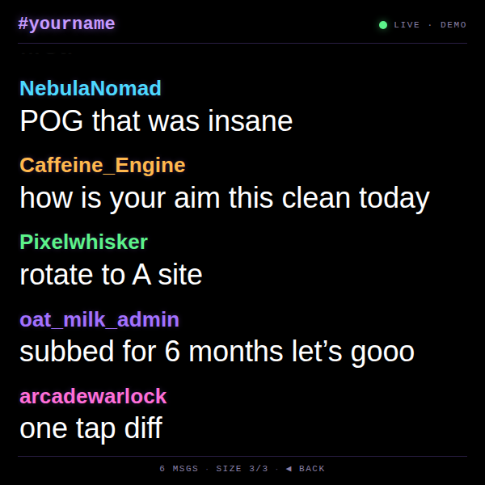
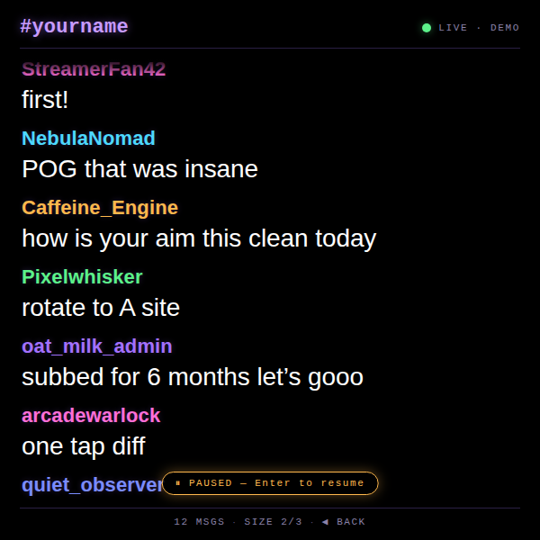
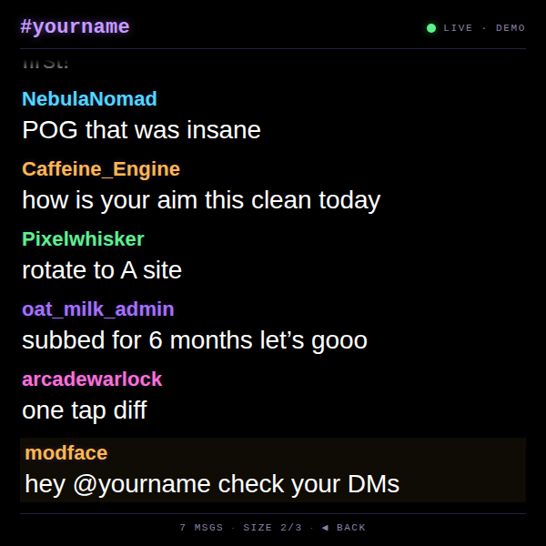

# Twitch Chat HUD

A heads-up display that streams **your Twitch chat in really large type** onto the Meta Display lens, so you can keep glancing at it while your hands are on the controller. Connects anonymously over IRC — no OAuth, no API key, no tokens to copy onto the device.

---

## What it does

- **Anonymous Twitch IRC over WebSocket.** Connects to `wss://irc-ws.chat.twitch.tv:443` as a `justinfan…` user (Twitch's well-known read-only login), so there is nothing to authenticate. Read-only — the app never sends messages.
- **Type-free channel picker.** A D-pad list of preset channels plus `?channel=<name>` URL override. Bookmark `…/twitch-chat/?channel=yourname` and the app auto-connects to your channel on open. Last-connected channel is remembered.
- **DEMO entry** at the top of the picker runs a fake live feed (no network) so you can tune the UI, scroll behaviour, and text size without going on stream.
- **Glanceable chat feed.** Coloured usernames (from the IRC `color` tag when the user set one, otherwise hashed into a fixed palette so each viewer is visually distinct) over **very large white message text** sized for the lens.
- **Three text sizes.** ▶ on the D-pad cycles small / default / huge. The setting is saved per device.
- **Auto-scroll with scroll-back.** New messages append at the bottom. Scroll ▲ to read history — a `⏸ PAUSED` pill appears so you know live chat isn't displayed; press Enter to snap back to live.
- **Mention highlight.** Messages containing `@yourchannel` get an amber side rail so you spot them at a glance.
- **Auto-reconnect.** If the socket drops, the app reconnects every 3 s until it joins again.

---

## Controls

| Where | Input | Result |
| --- | --- | --- |
| Channel picker | ▲ ▼ | Move focus through the list |
| Channel picker | Enter | Connect to focused channel |
| Chat | ▲ | Scroll up (auto-pauses live feed) |
| Chat | ▼ | Scroll down |
| Chat | ◀ | Back to channel picker |
| Chat | ▶ | Cycle text size (small / default / huge) |
| Chat | Enter | Resume live + snap to newest message |

---

## Screenshots

### Channel picker

| Pick from presets, recent, or `?channel=` |
| --- |
|  |

### Chat feed — three text sizes

| Small (size 1/3) | Default (size 2/3) | Huge (size 3/3) |
| --- | --- | --- |
|  |  |  |

### Scroll-back paused, and an @-mention highlight

| Scrolled up — live feed paused | `@yourname` mention highlighted in amber |
| --- | --- |
|  |  |

---

## Running locally

The app is a single static HTML/CSS/JS bundle — no build step.

```bash
npx serve -l 4233 twitch-chat
# then open http://localhost:4233
# or jump straight into a channel:
#   http://localhost:4233/?channel=xqc
```

### Regenerating screenshots

> 🛠️ **Developer tooling only.** The app itself has zero Chrome dependency — it's vanilla HTML/CSS/JS that runs in the Ray-Ban Meta Display's built-in browser. The block below is just the local recipe used on a Mac to refresh the PNGs in `screenshots/`.

The screenshots above are produced from headless Chrome against the `?state=…` URL parameter the app reads on load. Each state seeds a deterministic message set so frames are stable, and `?demo=1` (which `?state=` implies) skips the real WebSocket so the screenshots don't depend on live Twitch traffic.

```bash
npx serve -l 4333 twitch-chat &
CHROME="/Applications/Google Chrome.app/Contents/MacOS/Google Chrome"
for STATE in home chatting-small chatting chatting-big paused mention; do
  "$CHROME" --headless --disable-gpu --hide-scrollbars \
    --window-size=600,600 --virtual-time-budget=3000 \
    --screenshot="twitch-chat/screenshots/$STATE.png" \
    "http://localhost:4333/?state=$STATE"
done
```

---

## Files

```
twitch-chat/
├── index.html      # picker + chat screens
├── styles.css      # 600×600 black, Twitch-purple accents, three message-size presets
├── app.js          # IRC client (justinfan anon), D-pad state machine, demo/?state= routing
├── favicon.svg     # purple Twitch glyph on black
└── screenshots/    # generated state captures used by this README
```

---

<sub>Made by Alex Levin at [L+R](https://www.levinriegner.com).</sub>
