# World Cup 2026

A glanceable tournament companion for the Meta Display glasses — countdown, all 12 groups with 48 teams, full fixture list, bracket walker, and a live-match takeover. Pick a favourite team and the home screen starts counting down to **their** next kickoff instead of the opening match.

> Built on the open schedule from [openfootball/worldcup.json](https://github.com/openfootball/worldcup.json/tree/master/2026). Live group standings derive from a deterministic mock so the "during the cup" mode is fully demoable today; swap in a [football-data.org](https://www.football-data.org/) key when the tournament starts (see below).

---

## What it does

- **Two states, one app.** *Pre-tournament* mode shows a live countdown to the opening match (MEX vs RSA, 11 Jun, Mexico City). On 11 June it flips to *Live* mode automatically — pulsing LIVE pill, populated standings, scores on every match row, and a live-match takeover.
- **Follow a team.** Press Enter on any of the 48 teams to ★ follow them — your team is highlighted across every screen, and the home countdown retargets to *their* next kickoff. Persists in `localStorage`.
- **Groups carousel.** A → L, one group per screen, ranked rows with FIFA codes + flags. Standings populate live with points / GD / played as the tournament progresses.
- **Bracket walker.** Round-of-32 → Round-of-16 → QF → SF → 3rd Place → Final. ▲▼ scrolls matches inside a round, ◀▶ steps between rounds.
- **Day-by-day fixtures.** 34 match days from 11 Jun to 19 Jul; ◀▶ steps a day at a time, ▲▼ jumps a week.
- **Live-match takeover.** When you tap on a match that's currently in play (or open `?state=match-live`), it goes full-screen with score, minute clock, progress bar, and a synthesized scoring ticker driven by a small roster of star players per nation.
- **Local-time conversion.** Every match time is parsed from its scheduled local-tz string (e.g. `"13:00 UTC-6"`) and re-rendered in the wearer's local time — kickoffs always read correctly on the glasses regardless of where you are.

---

## Controls

| Where | Input | Result |
| --- | --- | --- |
| Home | ▲ ▼ ◀ ▶ | Move focus across the 2×2 menu (Groups, Teams, Bracket, Fixtures) |
| Home | Enter | Open the focused section |
| Groups | ◀ ▶ | Cycle Group A → L |
| Groups | ▲ | Back to home |
| Groups | Enter | Open group detail |
| Group detail | ▲ | Switch to Fixtures tab |
| Group detail | ▼ | Switch to Standings tab |
| Group detail | ◀ ▶ | Step to previous / next group |
| Group detail | Enter | Back to groups |
| Teams | ◀ ▶ | Cycle through 48 teams alphabetically |
| Teams | ▲ | Jump to first team of next group |
| Teams | ▼ | Open team's fixture list |
| Teams | Enter | Follow / unfollow this team |
| Team detail | ◀ ▶ | Switch to another team |
| Team detail | ▲ | Back to picker |
| Team detail | Enter | Follow / unfollow |
| Bracket | ◀ ▶ | Step rounds (R32 → R16 → QF → SF → 3rd → Final) |
| Bracket | ▲ ▼ | Scroll matches in the current round |
| Bracket | Enter | Back to home |
| Fixtures | ◀ ▶ | Step day-by-day |
| Fixtures | ▲ ▼ | Jump back / forward 7 days |
| Fixtures | Enter | Back to home |

Touch swipes mirror the D-pad on every screen (up / down / left / right swipes map to ▲ ▼ ◀ ▶).

---

## Screenshots

### Home

| Pre-tournament (default) | After following Argentina | After 11 Jun — live mode |
| --- | --- | --- |
| 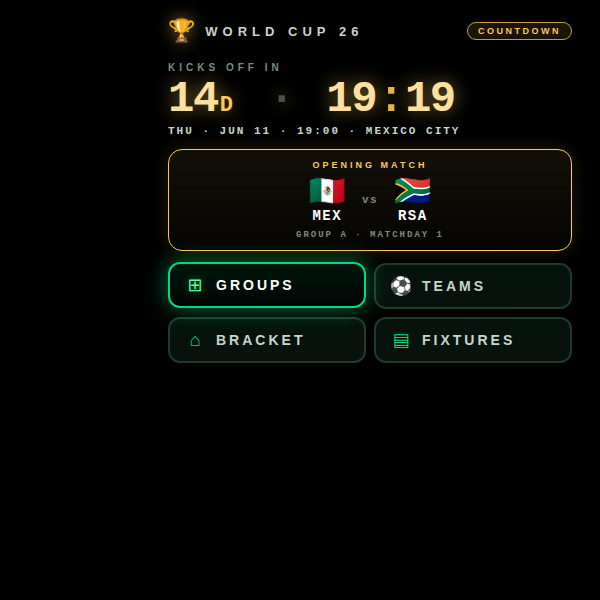 | 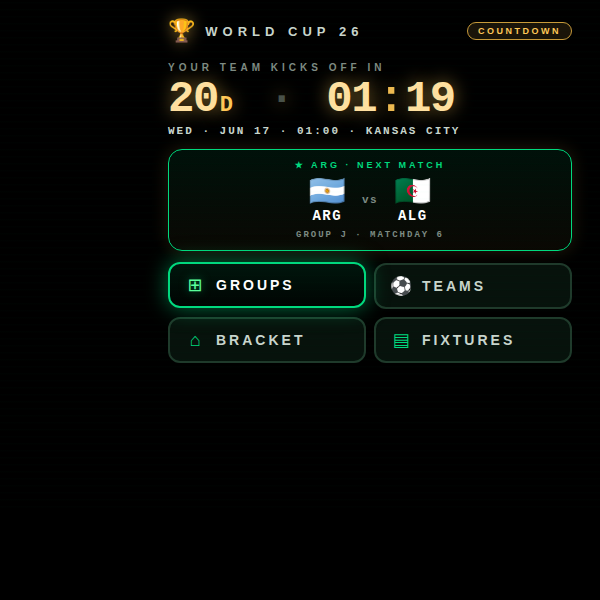 | 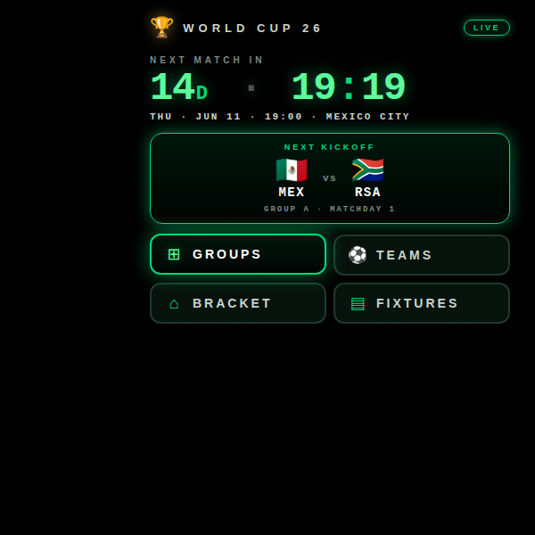 |

### Groups & teams

| Group A carousel | Group C carousel | Group C fixtures | Group C standings (live) |
| --- | --- | --- | --- |
| 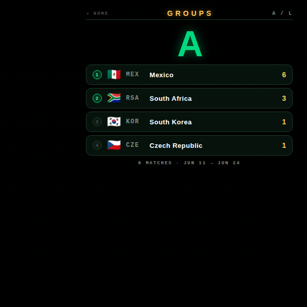 | 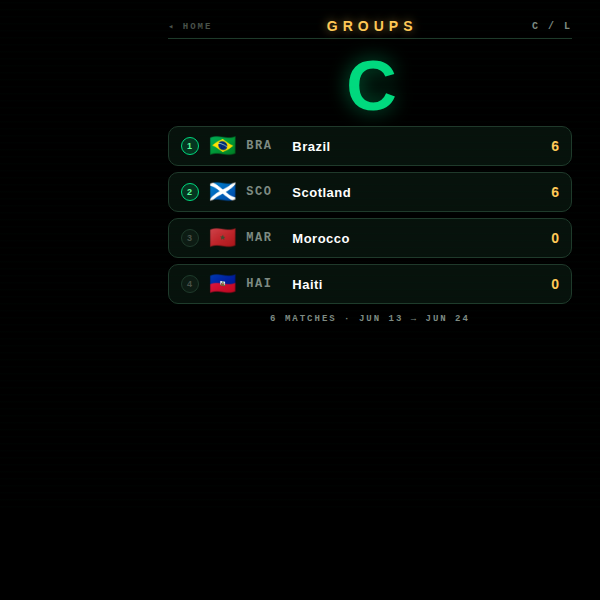 | 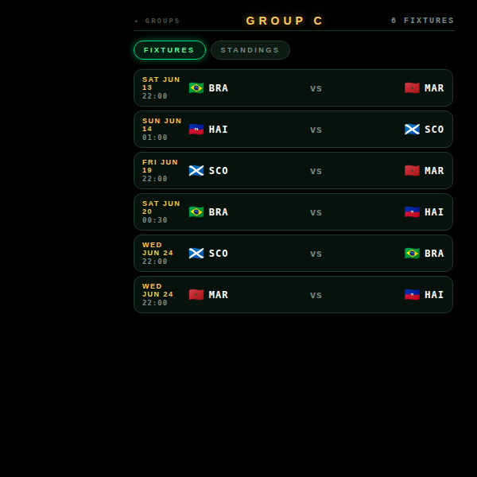 | 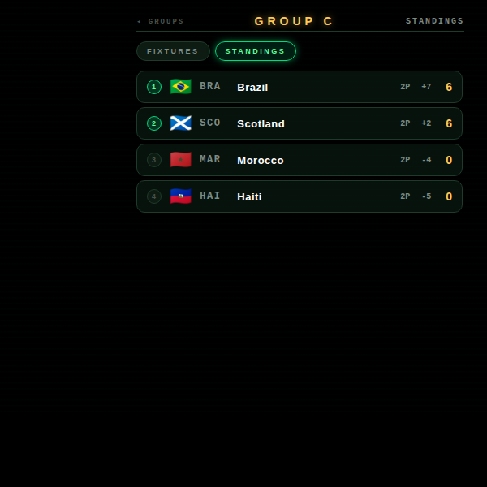 |

### Team picker

| Pick a team | Argentina fixtures (followed) |
| --- | --- |
| 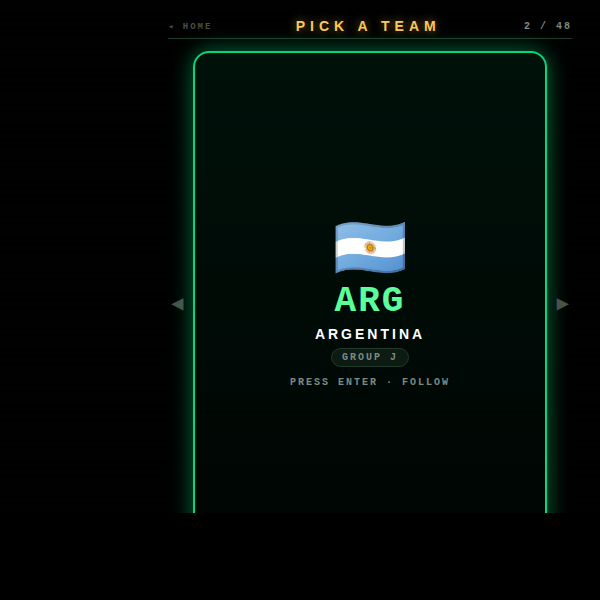 | 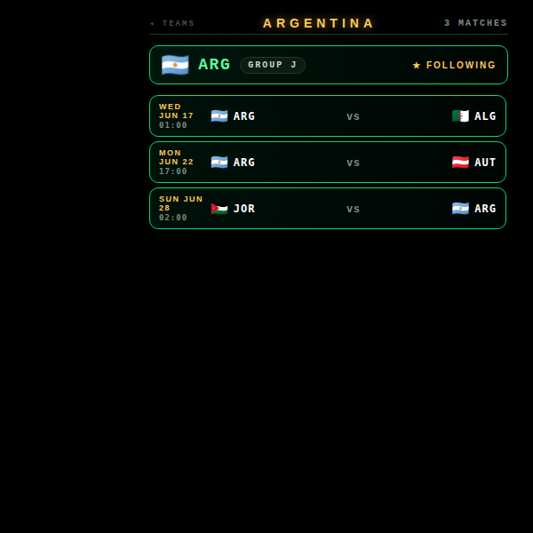 |

### Bracket walker

| Round of 32 | Round of 16 | Quarter-final | Final |
| --- | --- | --- | --- |
| 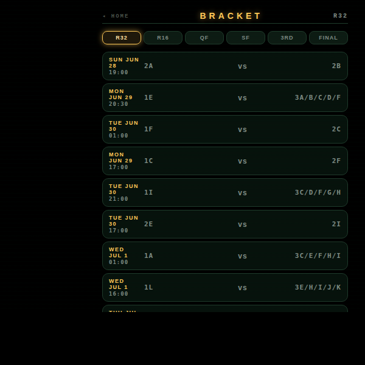 | 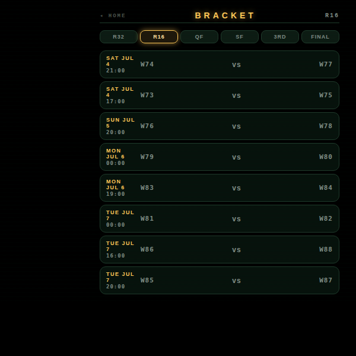 | 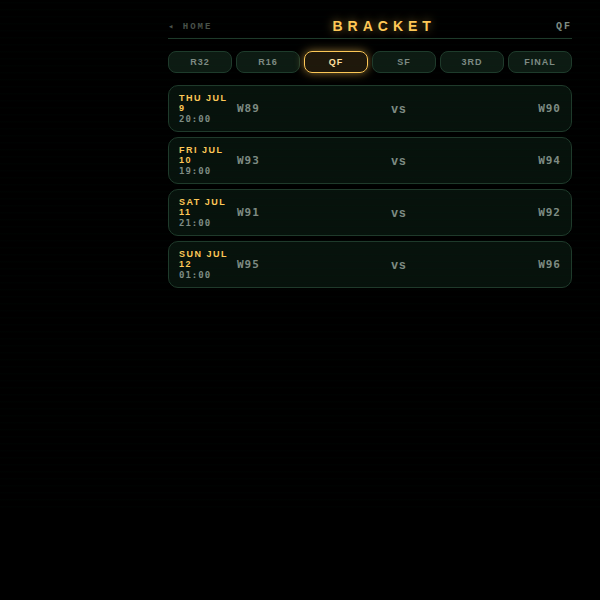 | 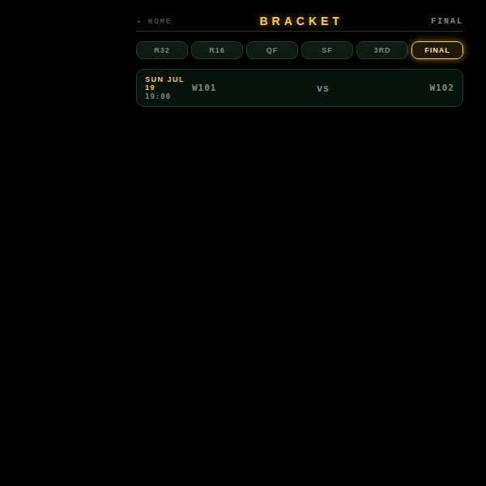 |

### Fixtures & live match

| Fixtures — day 1 | Fixtures — day 3 | Live-match takeover |
| --- | --- | --- |
| 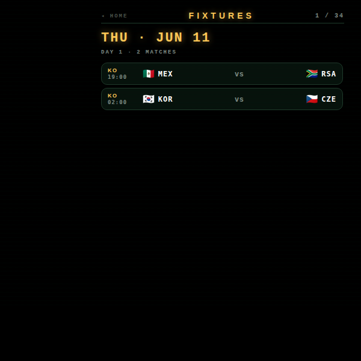 | 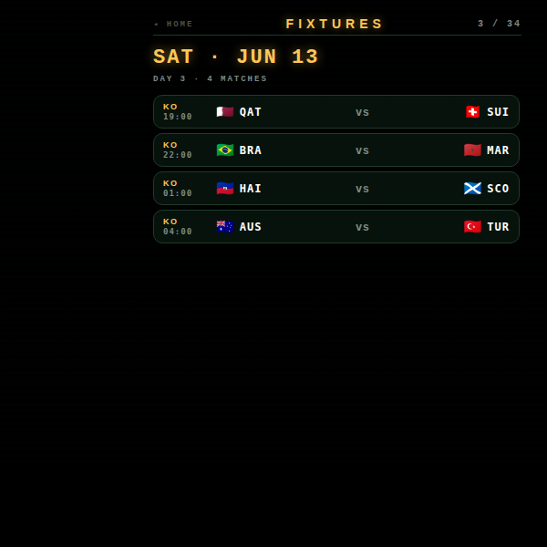 | 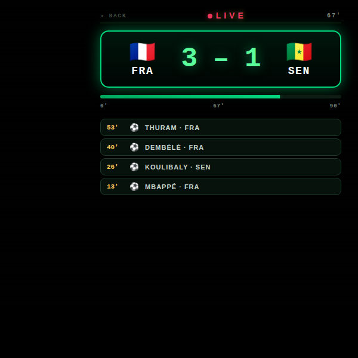 |

---

## Running locally

The app is a single static HTML/CSS/JS bundle — no build step.

```bash
npx serve -l 4226 worldcup-2026
# then open http://localhost:4226
```

### Wiring real live data

The app ships with a deterministic mock result table that drives all live-mode visuals (group standings, scores, the synthesized live-match event ticker). To swap in real scores once the tournament starts:

1. Get a free API key at [football-data.org](https://www.football-data.org/) (competition code `WC`).
2. Paste it into the `LIVE_API_KEY` constant near the top of `app.js`.
3. Plug a `fetch('https://api.football-data.org/v4/competitions/WC/matches', { headers: { 'X-Auth-Token': LIVE_API_KEY } })` call into `clockRef`'s neighbours and rewrite `matchResult(m)` to look up the corresponding `homeTeam` / `awayTeam` score.

The data model in this repo (team codes, flag emojis, group letters, match dates) was kept compatible with football-data.org's `matches` payload so the swap is largely a one-function change.

### Regenerating screenshots

> 🛠️ **Developer tooling only.** The app itself has zero Chrome dependency — it's vanilla HTML/CSS/JS that runs in the Ray-Ban Meta Display's built-in browser. The block below is just the local recipe used on a Mac to refresh the PNGs in `screenshots/`.

The screenshots above are produced from headless Chrome against the `?state=…` URL parameter the app reads on load:

```bash
npx serve -l 4326 worldcup-2026 &
CHROME="/Applications/Google Chrome.app/Contents/MacOS/Google Chrome"
for STATE in home home-fav home-live \
             groups-a groups-c group-fixtures group-c \
             teams team-fav \
             bracket-r32 bracket-r16 bracket-qf bracket-final \
             fixtures fixtures-day3 match-live; do
  "$CHROME" --headless --disable-gpu --hide-scrollbars \
    --window-size=600,600 --virtual-time-budget=3000 \
    --screenshot="worldcup-2026/screenshots/$STATE.png" \
    "http://localhost:4326/?state=$STATE"
done
```

---

## Files

```
worldcup-2026/
├── index.html      # home + 7 sub-screens (groups, group detail, teams, team detail, bracket, fixtures, live)
├── styles.css      # 600×600 right-aligned HUD; pitch green + trophy gold on pure black
├── app.js          # state machine, embedded schedule, time-zone math, mock live results
├── favicon.svg     # trophy + pitch line on black
└── screenshots/    # 16 state captures used by this README
```

---

<sub>Made by Alex Levin at [L+R](https://www.levinriegner.com).</sub>
