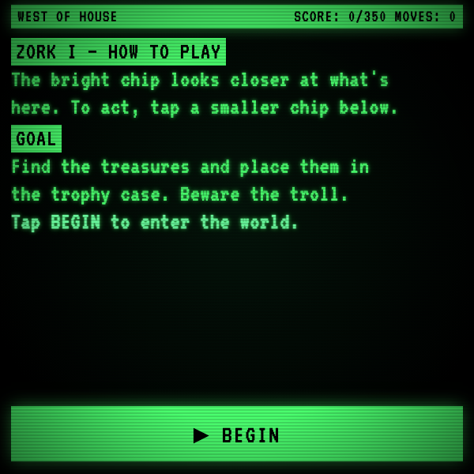
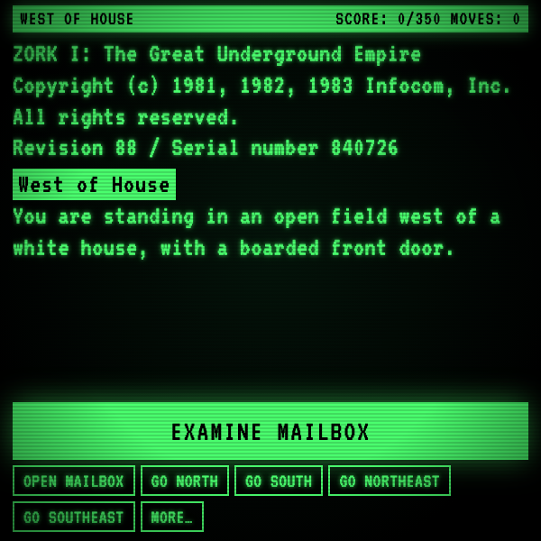
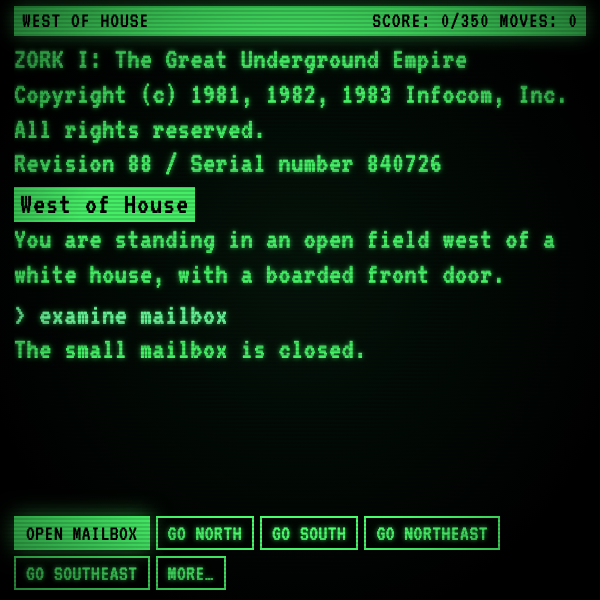
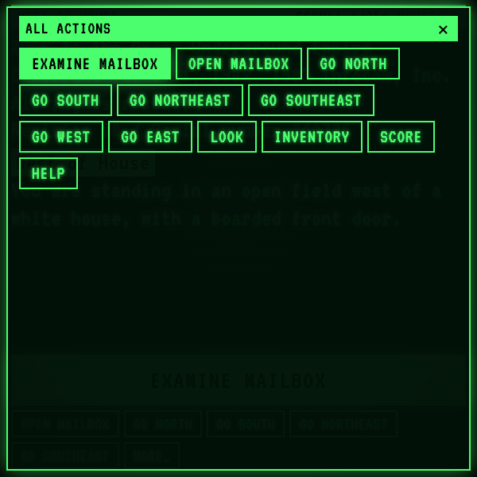

# Zork Terminal

A wearable-sized tribute to early-1980s text adventures, built for the 600×600 Meta Display HUD. Every action is picked from a chip — no typing, no microphone — with a smart "look closer" suggestion on top, every legal verb ranked underneath, and a green-phosphor CRT wrapped around the whole thing.

> 📖 **Case study:** [levinriegner.com/work/zork-i-tribute](https://www.levinriegner.com/work/zork-i-tribute/)

---

## What it does

- **CRT terminal aesthetic.** Green-on-black with scanlines, vignette, phosphor flicker, an inverted status bar at the top (room name + score + moves), and an inverted line for each new room title — the look of an Apple ][ booting an Infocom title in 1981. VT323 webfont with a system-monospace fallback.
- **Typewriter output.** Every line types in at ~220 chars/sec, paced by real time via a `MessageChannel` loop so it stays smooth even when the browser tab is throttled in the background. Tap anywhere mid-type to skip to the end.
- **Smart primary chip — *flavor only, never auto-progresses.*** The big bright chip at the bottom is always an `examine X` for the most narratively interesting unseen object in the room (or held). It describes; it does not advance the story. Once you've examined what's around, the chip disappears entirely — there's no tap-tap-tap-to-win loop.
- **Secondary chips hold every real action.** Open, take, move, read, attack, put, climb, `go <dir>` — pulled from a tiered priority ranking (story-critical → smart suggested direction → other exits → flavor → utility). Primary and secondary come from the same de-duped ranked list, so no chip ever appears twice.
- **MORE… panel.** A full-screen "All actions" grid with every contextually-valid command available this turn. Selecting any chip closes the panel, runs the command, and returns focus to the main screen's primary chip.
- **Filled-green = selected, on every screen.** The focused chip is the one filled green. Keyboard arrows and touch swipes both navigate in 2D using bounding-rect geometry. Row wrap-around: swipe right off the end of a row jumps to the leftmost chip of the next row, and the reverse on swipe left.
- **Synthesized audio (no audio files).** Web Audio `AudioContext` driving a tiny synth for typewriter ticks (throttled to ~50 Hz), chip taps, boot zap, score chimes, combat hits and misses, grue death sweep, and a four-note victory arpeggio. Created lazily inside the first user gesture to respect autoplay policy.
- **Compact world, full arc.** ~14 rooms covering the open field, the white house interior, and the early underground (cellar → troll → gallery), three treasures to recover and deposit in the trophy case, one nasty monster — a complete winnable run sized for a glasses-length sitting.

---

## Controls

| Where | Input | Result |
| --- | --- | --- |
| Anywhere | Enter | Run the focused chip |
| Anywhere | ▲ ▼ ◀ ▶ / swipe | Move focus between chips (2D) |
| Output area | Enter | Skip the current typewriter line |
| Secondary row | ▶ on rightmost chip | Wrap to leftmost chip of next row |
| Secondary row | ◀ on leftmost chip | Wrap to rightmost chip of previous row |
| Primary | ▼ / swipe down | Jump to first secondary chip on the left |
| MORE… panel | Enter | Run focused command, close panel, refocus primary |

Touch swipes mirror the arrow keys everywhere — primary, secondary, and the MORE panel grid share one navigation model.

---

## Screenshots

### Boot / instructions

| Default boot screen |
| :---: |
|  |

### Gameplay

| First room — primary chip suggests an `examine` | After examining — primary hidden, only real actions remain |
| --- | --- |
|  |  |

### All-actions panel

| MORE… opens a full-grid view of every contextually-valid command |
| :---: |
|  |

---

## Running locally

The app is a single static HTML/CSS/JS bundle — no build step.

```bash
npx serve -l 4203 zork-terminal
# then open http://localhost:4203
```

Inside the `meta-display-glasses-webapps` workspace it's also wired into `.claude/launch.json` as the `zork-terminal` preview target on port **4203**.

### Regenerating screenshots

> 🛠️ **Developer tooling only.** The app itself has zero Chrome dependency — it's vanilla HTML/CSS/JS that runs in the Ray-Ban Meta Display's built-in browser. The block below is just the local recipe used on a Mac to refresh the PNGs in `screenshots/`.

The screenshots above come from headless Chrome against the `?state=…` URL parameter the app reads on load:

```bash
npx serve -l 4203 zork-terminal &
CHROME="/Applications/Google Chrome.app/Contents/MacOS/Google Chrome"
"$CHROME" --headless=new --disable-gpu --hide-scrollbars \
  --window-size=600,600 --virtual-time-budget=4000  \
  --screenshot=zork-terminal/screenshots/01-boot.png      \
  "http://localhost:4203/"
"$CHROME" --headless=new --disable-gpu --hide-scrollbars \
  --window-size=600,600 --virtual-time-budget=9000  \
  --screenshot=zork-terminal/screenshots/02-gameplay.png  \
  "http://localhost:4203/?state=gameplay"
"$CHROME" --headless=new --disable-gpu --hide-scrollbars \
  --window-size=600,600 --virtual-time-budget=10000 \
  --screenshot=zork-terminal/screenshots/03-explored.png  \
  "http://localhost:4203/?state=explored"
"$CHROME" --headless=new --disable-gpu --hide-scrollbars \
  --window-size=600,600 --virtual-time-budget=11000 \
  --screenshot=zork-terminal/screenshots/04-more.png      \
  "http://localhost:4203/?state=more"
```

`?state=` values: `boot` (default), `gameplay`, `explored`, `more`.

---

## Files

```
zork-terminal/
├── index.html      # CRT shell: status bar, output, chip bar, MORE panel
├── styles.css      # Green-phosphor palette, scanlines/vignette/flicker, chips
├── world.js        # Rooms, items, initial game state
├── app.js          # Typewriter queue, parser, verbs, chip ranking + 2D nav,
│                   #   Web Audio synth, ?state= URL router
└── screenshots/    # Generated state captures used by this README
```

---

<sub>Made by Alex Levin at [L+R](https://www.levinriegner.com).</sub>
